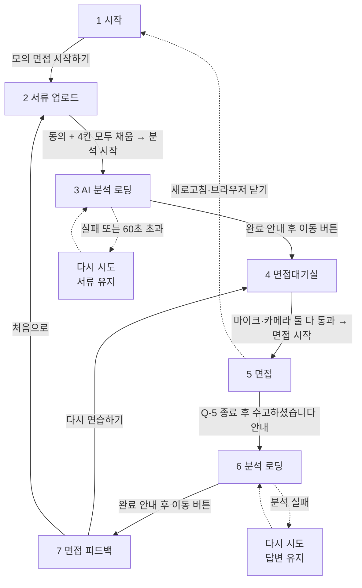
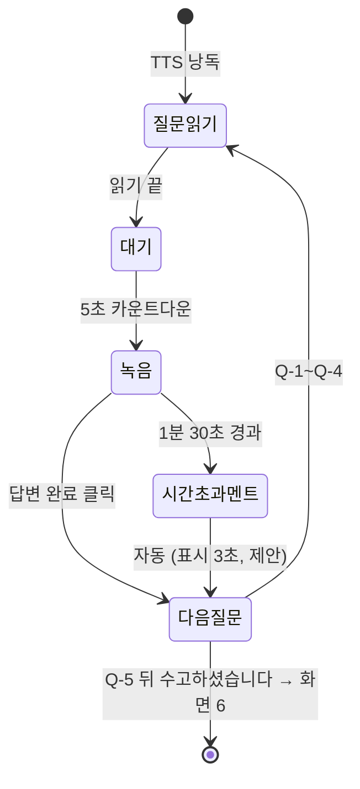

# 화면 흐름도·화면정의서

> 한 줄 요약: 사용자는 7개 화면을 한 방향으로 지나간다. 화면별 목적·표시·동작·이동 조건·예외를 정의한다.
> 기준: Claude Docs 2026-09-29 버전 「화면별 기능정의서」 (확정 / **(제안)** 구분 유지)
> 관련: 기획 [docs/01-PRD.md](01-PRD.md), 백엔드 규칙 [docs/03-functional-spec.md](03-functional-spec.md), API [docs/04-api-schema.md](04-api-schema.md)

## 1. 전체 흐름



- 새로고침 시 진행 중이던 면접을 버리고 처음(화면 1 또는 서류 업로드)부터 다시 한다 (확정, 어느 쪽인지는 미정).
- 「다시 연습하기」는 같은 서류로 질문을 다시 만들어 화면 4로, 「처음으로」는 새 서류 업로드(화면 2)로 간다 (확정).
- 화면 1은 API를 부르지 않는다. 화면 ↔ 상태값 대응은 표 하나로 정리한다.

| 화면 | 세션 status |
| --- | --- |
| 3 AI 분석 로딩 | PREPARING |
| 4 면접대기실 | READY |
| 5 면접 | IN_PROGRESS |
| 6 분석 로딩 | EVALUATING |
| 7 면접 피드백 | COMPLETED |
| (복구 불가 오류) | FAILED → 다시 시도 버튼 |

## 2. 화면 1. 시작

목적: 서비스를 한 화면으로 소개하고 면접을 시작하게 한다.

```
+--------------------------------------+
|  ProofInterview                      |
|  내 지원서류를 파고드는 면접관,       |
|  근거로 설명하는 평가                 |
|  ① 서류 업로드 ② 질문 5개 ③ 피드백   |
|        [ 모의 면접 시작하기 ]         |
+--------------------------------------+
```

| 항목 | 내용 |
| --- | --- |
| 표시 | 서비스 소개, 「모의 면접 시작하기」 (확정). 한 줄 소개·3단계 안내 (제안) |
| 동작 | 버튼 클릭 → 화면 2 |
| 예외 | 없음 |

## 3. 화면 2. 서류 업로드

목적: 개인정보 동의와 서류 4종(이력서, 채용공고(인재상 포함), 직무기술서, 자기소개서 모두 필수)을 받는다. 하나라도 비면 진행 불가.

```
+--------------------------------------+
| [파일 업로드 | 텍스트 직접 입력]        |
| 이력서        [입력됨]                |
| 채용공고      [비어 있음]  (인재상 포함)|
| 직무기술서    [비어 있음]                |
| 자기소개서    [비어 있음]                |
| [ ] 개인정보 동의 (요약 보기)          |
|            [ 분석 시작 ] (비활성)      |
+--------------------------------------+
```

| 항목 | 내용 |
| --- | --- |
| 표시 | 4칸 각각 「파일 업로드(PDF·DOCX·TXT)」·「텍스트 직접 입력」 탭, 개인정보 동의 (확정). 칸별 입력 상태, 동의 요약(수집 항목·목적, 녹음은 변환용 서버 업로드 후 삭제, 영상은 전송·저장 안 함) (제안) |
| 동작 | 동의 + 4칸 모두 채움 → 「분석 시작」 활성화 → 서류 전송 후 화면 3 (확정) |
| 예외 (제안) | 추출 글자가 너무 적으면 해당 칸을 텍스트 입력 탭으로 전환하고 안내. HWP·이미지 스캔 PDF는 미지원 안내 |

## 4. 화면 3. AI 분석 로딩

목적: 서류를 읽고 질문을 준비하는 20~40초 동안 진행 단계를 보여준다.

```
+--------------------------------------+
| ✅ 채용공고 읽는 중   요구사항 n개 확인 |
| ✅ 이력서·자소서 읽는 중 경험 n개, 주장 n개|
| ⏳ 공고와 경험 연결 중                 |
| ☐ 검증 포인트 찾는 중                  |
| ☐ 질문 준비 중  ☐ 질문 검수 중         |
+--------------------------------------+
```

| 항목 | 내용 |
| --- | --- |
| 표시 (확정) | 6단계(채용공고 읽는 중 → 이력서·자소서 읽는 중 → 공고와 경험 연결 중 → 검증 포인트 찾는 중 → 질문 준비 중 → 질문 검수 중), 완료 ✅ / 진행 중 ⏳ / 대기 ☐. 완료 뒤 수치는 1·2단계에만 표시. 로딩 완료 안내 |
| 동작 (제안) | 완료 안내 아래 「면접대기실로」 버튼 → 화면 4 |
| 규칙 (제안) | 질문 문장·검증 포인트 내용은 노출하지 않는다 |
| 예외 (제안) | 분석 실패 또는 60초 초과 → 「다시 시도」, 입력한 서류 유지 |

## 5. 화면 4. 면접대기실

목적: 마이크·카메라가 둘 다 되는 것을 확인한다.

```
+--------------------------------------+
|  [카메라 미리보기]   마이크 ▮▮▮▯▯    |
|  카메라 ✅  마이크 ✅                  |
|  안내: 질문 5개, 질문당 최대 1분 30초 |
|  영상은 서버로 전송·저장되지 않습니다   |
|  [다시 확인]        [ 면접 시작 ]      |
+--------------------------------------+
```

| 항목 | 내용 |
| --- | --- |
| 표시 | 장치 확인, 「면접 시작」 (확정). 카메라 미리보기, 음량 막대, 장치별 통과 여부, 면접 안내(질문 5개, 최대 1분 30초, 질문 낭독 후 5초 뒤 녹음, 면접 중 피드백 없음), 「영상은 서버로 전송·저장되지 않고 시선 지표는 점수에 반영되지 않는 참고값입니다」 (제안) |
| 동작 | 둘 다 통과 → 「면접 시작」 활성화 → 화면 5 (확정) |
| 예외 | 하나라도 안 되면 시작 불가 (확정). 권한 허용 방법 안내 + 「다시 확인」 (제안) |

## 6. 화면 5. 면접

목적: 질문 5개를 고정 순서로 묻고 답변을 녹음한다. 꼬리질문 없음, 아이스브레이킹 없음.

순서: Q-1 자기소개 → Q-2 인성 → Q-3 인성 → Q-4 기술 → Q-5 기술 (확정)



```
+--------------------------------------+
| 질문 2 / 5              [내 카메라]   |
|  (면접관)  "질문 문장…"               |
|  ● 녹음 중   남은 시간 01:12          |
|              [ 답변 완료 ]            |
+--------------------------------------+
```

| 단계 | 화면 | 다음 조건 |
| --- | --- | --- |
| 1 질문 읽기 | 질문 문장 + TTS | 읽기 끝 |
| 2 대기 | 5초 카운트다운, 녹음 안 함 | 5초 경과 |
| 3 녹음 | 「녹음 중」, 남은 시간, 「답변 완료」 | 클릭 또는 1분 30초 경과 |
| 4-a 답변 완료 | 녹음 멈추고 바로 다음 질문 1단계 | 자동 |
| 4-b 시간 초과 | 「미안합니다 시간이 없어서 다음 질문으로 넘어가겠습니다」 텍스트 멘트 | 멘트 후 자동 |

| 항목 | 내용 |
| --- | --- |
| 표시 (제안) | 진행률(「질문 2 / 5」), 내 카메라 작은 미리보기, 면접관 1명(확정)과 멘트 영역 |
| 규칙 | 실시간 자막 없음(확정). 면접 중 점수·피드백 미노출 (제안). 답변 전송 후 변환은 백그라운드 |
| 질문별 저장 (제안) | 서버 STT 변환 텍스트, 답변 시간(초), 시간 초과 여부, 시선 측정값 |
| 새로고침 | 면접을 버리고 처음부터 다시 (확정) |
| 예외 (제안) | TTS 실패 → 질문 텍스트만 보여주고 진행. 녹음 끊김·무음·업로드/변환 실패 → 「답변 인식 안 됨」으로 기록하고 다음 질문 진행 |
| 종료 | Q-5 뒤 「수고하셨습니다」 안내 → 화면 6 |

## 7. 화면 6. 분석 로딩

목적: 답변을 분석해 피드백을 만드는 동안 진행을 보여준다.

| 항목 | 내용 |
| --- | --- |
| 표시 | 「분석 중」→「분석 완료」, 화면 3처럼 단계별 진행 표시 (확정). 단계 문구: 답변 변환 중 → 태도 분석 중 → 직무 적합성 분석 중 → 답변 일관성 분석 중 → 피드백 정리 중 (제안) |
| 동작 (제안) | 완료 안내 아래 「피드백 보기」 → 화면 7 |
| 예외 (제안) | 분석 실패 → 「다시 시도」, 면접 답변 유지 |

## 8. 화면 7. 면접 피드백

목적: 영역별 피드백 3종과 질문별 상세를 보여준다. 합격 예측·채용 점수 등 판정성 표현은 쓰지 않는다.

```
+--------------------------------------+
| [태도] 측정값 + 조언 (점수 없음)       |
| [직무 적합성] 라벨 + 인용 + 이유       |
| [답변 일관성] 라벨 + 인용 + 이유       |
| ▼ 질문별 상세 Q-1 … Q-5               |
|   질문 원문 / 내 답변 / 피드백 / 연결   |
|  [ 다시 연습하기 ]  [ 처음으로 ]       |
+--------------------------------------+
```

| 영역 | 형태 | 근거 | 비고 |
| --- | --- | --- | --- |
| 태도 | 측정값 + AI 조언 문장, 판정·점수 없음 | 말투: 답변 인용, 시선처리: 정면 유지 비율·이탈 횟수, 시간 초과: 질문별 답변 시간·초과 횟수 | Must: 말투·시선처리·시간 초과. Should: 분당 단어 수, 군말 횟수 |
| 직무 적합성 | 판정 라벨 + 인용 + 이유 | 직무기술서·채용공고와 답변 | 라벨 충분 / 보완 필요 / 미흡 / 판단 보류 (제안) |
| 답변 일관성 | 판정 라벨 + 인용 + 이유 | 자소서 내용과 답변 | 라벨 동일 (제안) |

- 질문별 상세(확정): 질문 원문, 내 답변(변환 텍스트), 피드백 칸, 연결 정보(서류 주장·확인 포인트, 서류에서 나온 질문에만 표시(제안)). 기술 이해는 질문별 상세에만 둔다.
- 예외 (제안): 답변 인식 안 된 질문은 「답변이 기록되지 않았습니다」로 표시하고 판정 제외. 카메라 측정 안 된 구간은 「측정 불가」.
- 끝 버튼 (확정): 「다시 연습하기」→ 화면 4, 「처음으로」→ 화면 2.

## 9. 미정 사항 (킥오프에서 정할 것)

- 새로고침 시 돌아가는 곳: 화면 1 vs 화면 2
- 「다시 연습하기」의 질문 재생성 호출 방식 (Docs의 API 4개에 재생성용 호출이 없음)
- 질문 음성(TTS): 브라우저 기능 vs 서버 모델 (서버면 API 5개)
- 판정 라벨 문구와 영역 판정 집계 규칙
