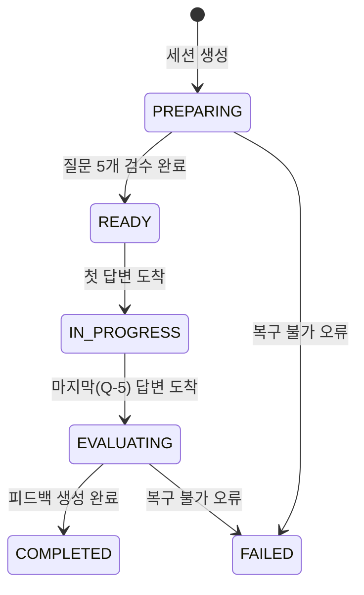

# 기능명세서

> 한 줄 요약: 화면 뒤에서 일어나는 처리(서류 분석 → 질문 생성 → 녹음·STT → 피드백 → 인용 검증)를 기능 ID별로 입력/처리/출력/규칙/예외로 정의한다.
> 기준: Claude Docs 2026-09-29 버전 「화면별 기능정의서」·「개발 계약·담당표」 (**(제안)** = 미확정)
> 관련: 화면 [docs/02-screen-flow.md](02-screen-flow.md), 기획 [docs/01-PRD.md](01-PRD.md), API·스키마 [docs/04-api-schema.md](04-api-schema.md), 아키텍처 [docs/05-architecture.md](05-architecture.md), 테스트 [docs/08-test-scenarios.md](08-test-scenarios.md)

## 0. 공통 규칙

- 면접 한 번 = 세션 하나(`session_id`, `S-` + 8자리). 세션은 메모리에 두며 서버 재시작 시 소실을 허용한다.
- 모든 ID는 코드가 만든다. LLM은 기존 ID를 참조만 하고 코드가 실재 여부를 검사한다. `turn_id`는 쓰지 않는다.
- LLM 출력은 Pydantic 구조화 출력. 실패하면 1회 재시도 후 노드별 fallback 값을 넣는다.
- 코드로 계산할 수 있는 값(답변 시간, 분당 단어 수, 군말 횟수, 인용 위치, 판정 집계)은 LLM에게 시키지 않는다.
- 오래 걸리는 일(서류 분석, 음성 변환, 피드백 생성)은 즉시 응답하고 백그라운드에서 처리한다.
- 면접 중 API 응답에 질문의 기대 요소·평가 기준(`criteria`)·연결 정보를 넣지 않는다.
- 카메라 측정값은 점수·판정에 쓰지 않는다. 음성은 변환 후 삭제, 영상은 서버로 받지 않는다.

상태 전이 (`status`):

## 1. 기능 목록

| ID | 기능 | 우선 | 화면 |
| --- | --- | --- | --- |
| F-001 | 서류 접수·텍스트 추출 | Must | 2 |
| F-002 | 세션 생성·분석 시작 | Must | 2→3 |
| F-003 | 서류 분석 (요구사항·주장·검증 포인트·연결) | Must | 3 |
| F-004 | 질문 5개 생성·고정 순서 배정 | Must | 3 |
| F-005 | 질문 코드 검증 | Must | 3 |
| F-006 | 진행 상태·단계 조회 | Must | 3·6 |
| F-007 | 답변 녹음 수신 | Must | 5 |
| F-008 | 서버 STT 변환·음성 삭제 | Must | 5→6 |
| F-009 | 태도 피드백 생성 | Must / Should | 7 |
| F-010 | 직무 적합성 피드백 생성 | Must | 7 |
| F-011 | 답변 일관성 피드백 생성 | Must | 7 |
| F-012 | 질문별 피드백·연결 정보 | Must | 7 |
| F-013 | 인용 코드 검증 | Must | 7 |
| F-014 | 피드백 조회 | Must | 7 |

## 2. 기능별 명세

### F-001 서류 접수·텍스트 추출 (담당 A)

| 항목 | 내용 |
| --- | --- |
| 입력 | 서류 4종(이력서, 채용공고(인재상 포함), 직무기술서, 자소서) 각각 파일(`*_file`) 또는 텍스트(`*_text`) 중 하나, `privacy_consent` |
| 처리 | PDF·DOCX·TXT에서 텍스트 추출, 텍스트 입력은 그대로 사용 |
| 출력 | `resume_text`, `job_posting_text`, `job_description_text`, `cover_letter_text`, `consent_at`(ISO-8601) |
| 규칙 | 4종 모두 필수, 동의 필수 |
| 예외 | `422 MISSING_REQUIRED_DOC`(field 포함), `422 CONSENT_REQUIRED`, `422 TEXT_EXTRACTION_FAILED`(field 포함, 해당 칸을 텍스트 입력으로 전환). HWP·이미지 스캔 PDF 미지원 (제안). 추출 글자 수 최소 기준은 미정 |

### F-002 세션 생성·분석 시작 (담당 C)

- 입력: F-001 결과. 처리: `session_id` 발급, `status=PREPARING`, 백그라운드로 F-003~F-005 시작. 출력: `201 { session_id, status: PREPARING }`. 예외: F-001의 오류 코드.

### F-003 서류 분석 (담당 A)

| 항목 | 내용 |
| --- | --- |
| 입력 | 서류 텍스트 4종 |
| 처리 | 채용공고·직무기술서 → `Requirement`(RQ-, kind: SKILL/DUTY/TALENT, 인재상은 TALENT). 이력서·자소서 → `Claim`(CL-, types: METRIC/ROLE/TECH/PROBLEM/DECISION/COLLAB/MEASURE) → `Checkpoint`(CP-, 확인할 것). 요구사항–경험 연결 `RequirementLink` |
| 출력 | `Analysis { requirements, claims, checkpoints, links }` |
| 규칙 | `Claim.text`는 원문 그대로이며 코드가 원문 포함 여부를 검사. ID는 코드가 발급. `links.claim_ids`가 비면 「서류에 근거 없음」. 주장은 사실 여부를 단정하지 않고 확인 대상으로만 다룸(PLAN.md 참고, 원칙 유지) |
| 예외 | LLM 출력 실패 → 1회 재시도 후 fallback. 분석 60초 초과·실패는 화면 3에서 「다시 시도」 |

### F-004 질문 5개 생성·고정 순서 배정 (담당 B)

| 항목 | 내용 |
| --- | --- |
| 입력 | `Analysis`, 질문 은행(기술 `TECH-주제-3자리`, 인성 `COMP-역량-3자리`, 각 10개 목표) |
| 처리 | Q-1 INTRO(자기소개), Q-2·Q-3 BEHAVIOR(인성), Q-4·Q-5 TECH(기술) 고정 배정. 서류에서 나온 질문은 `checkpoint_ids`, TECH·BEHAVIOR는 `question_bank_id`, 평가 기준은 `criteria` |
| 출력 | `Question[5] { question_id, order, type, text, checkpoint_ids, question_bank_id, criteria }` |
| 규칙 | 아이스브레이킹·꼬리질문 없음. 면접관 1명. 질문 5개는 분석 단계에서 모두 만들어 두고 면접 중 서버 판단 없음. `criteria`는 면접 중 노출 금지 |
| 예외 | 코드 검증 실패 시 재생성 횟수는 미정 |

### F-005 질문 코드 검증 (담당 B)

- 입력: `Question[5]`. 처리: 질문 수 5개·`Q-1`~`Q-5` 순서·type 배치, 서류 질문의 `checkpoint_ids`가 실재하는지, TECH·BEHAVIOR의 `question_bank_id` 실재 여부 검사. 출력: 통과 시 `status=READY`. 중복 질문 검사는 PLAN.md 근거의 (제안). 질문 의미 검증(LLM)은 Docs에 없음 → 미정.

### F-006 진행 상태·단계 조회 (담당 C)

| 항목 | 내용 |
| --- | --- |
| 입력 | `GET /api/interviews/{id}`, 프런트가 2초 간격 호출 |
| 출력 | `status`, `steps[{step_id,label,state(PENDING/RUNNING/DONE),detail}]`, `READY` 이후 `questions[{question_id,order,type,text}]`, `FAILED`이면 `error` |
| 규칙 | PREPARING 단계: `read_posting`, `read_resume`, `link`, `checkpoints`, `questions`, `review`. EVALUATING 단계: `transcribe`, `attitude`, `job_fit`, `consistency`, `compose`. `detail`은 「요구사항 n개」, 「경험 n개, 확인할 주장 n개」처럼 완료 뒤 수치. 질문 내용·평가 기준·연결 정보는 미포함 |
| 예외 | `404 SESSION_NOT_FOUND`. 오류 응답 형식 `{"error":{"code","message"}}` |

### F-007 답변 녹음 수신 (담당 C, 프런트 D)

| 항목 | 내용 |
| --- | --- |
| 입력 | 질문 1개당 1회 `POST /api/interviews/{id}/answers`: `question_id`, `audio`(webm, 마이크 끊기면 없을 수 있음), `duration_sec`, `timed_out`, `delivery_metrics{measurable, frontal_ratio 0~1, gaze_away_count}` |
| 처리 | `Answer` 저장, `transcript_status=PENDING`, STT를 백그라운드로 시작. 첫 답변에 `IN_PROGRESS`, Q-5 수신 시 `EVALUATING` |
| 출력 | `202 { question_id, received, next_question_id, status }` (Q-5는 `next_question_id=null`) |
| 규칙 | 같은 `question_id` 재전송은 이전 응답을 그대로 반환. 녹음 제한 1분 30초, 초과 시 프런트가 `timed_out=true`로 전송. 화면은 변환을 기다리지 않고 다음 질문으로 이동 |
| 예외 | `404 SESSION_NOT_FOUND`, `409 NOT_IN_PROGRESS`, `422 UNKNOWN_QUESTION`. 오디오 없음은 F-008 처리 |

### F-008 서버 STT 변환·음성 삭제 (담당 C)

| 항목 | 내용 |
| --- | --- |
| 입력 | 답변 녹음 파일 |
| 처리 | 답변 종료 후 파일 단위로 변환(Live 스트리밍·실시간 자막 없음). 변환 후 음성 파일 삭제. `words_per_min`, `filler_count`는 코드가 transcript에서 계산 (Should). 변환은 Gemini 오디오 입력(`STT_MODE`, `STT_MODEL`), 군말은 지우지 않고 받아 적음 |
| 출력 | `Answer.transcript`, `transcript_status`(`DONE`/`NO_SPEECH`/`FAILED`) |
| 규칙 | 삭제는 성공·실패 무관하게 수행하는 것이 원칙이나 실패 시 보관 정책은 미정. 평가 시작 시점은 마지막 답변과 STT 변환이 모두 끝난 뒤 |
| 예외 | 무음 → `NO_SPEECH`, 변환 실패 → `FAILED`. 면접은 그대로 진행하고 해당 질문은 「답변 인식 안 됨」 → 판정 제외 |

### F-009 태도 피드백 생성 (담당 E)

| 항목 | 내용 |
| --- | --- |
| 입력 | 전 질문 `Answer`(transcript, `duration_sec`, `timed_out`, `delivery`, `words_per_min`, `filler_count`) |
| 처리 | 측정값은 코드 집계. AI는 말투 조언 문장만 작성 |
| 출력 | `AttitudeFeedback { metrics, advice[], quotes[] }`. metrics: 말투(Should: `words_per_min`, `filler_count`), 시선(`measurable`, `frontal_ratio`, `gaze_away_count`), 시간 초과(`timed_out_count`, 질문별 `duration_sec`) |
| 규칙 | 판정·점수 없음. Must는 말투·시선처리·시간 초과, Should는 분당 단어 수·군말 횟수. 말투 조언은 답변 인용(`quotes`) 동반. 카메라 값은 참고 측정값 |
| 예외 | `measurable=false` 구간은 「측정 불가」로 표시하고 계산에서 제외 |

### F-010 직무 적합성 피드백 생성 (담당 E)

- 입력: 채용공고·직무기술서 기반 `Requirement`, 답변 transcript. 처리: 답변이 요구사항에 맞는지 LLM 판정. 출력: `FitFeedback { verdict, reason, quotes[], refs[] }`(refs = `requirement_id`). 판정값 `SUFFICIENT`/`NEEDS_WORK`/`INSUFFICIENT`/`WITHHELD`(라벨 문구 충분/보완 필요/미흡/판단 보류는 제안). 규칙: 인용은 F-013 통과분만. 예외: 인식 안 된 답변은 판정에서 제외. 질문별 판정을 영역 판정으로 집계하는 규칙은 미정.

### F-011 답변 일관성 피드백 생성 (담당 E)

- F-010과 같은 형식. 비교 근거는 자기소개서 내용(`Claim`)과 답변, `refs`는 `claim_id`. 서류에 없는 새 내용을 이유만으로 불일치로 단정하는지는 Docs에 없음(미정). 진위 판단이 아닌 서류–답변 일치 여부만 다룬다.

### F-012 질문별 피드백·연결 정보 (담당 E)

- 입력: `Question`, `Answer`, 연결된 `Claim`·`Checkpoint`. 출력: `QuestionFeedback { question_id, strengths[], gaps[], next_action, linked_claim_ids[], linked_checkpoint_ids[] }`. 규칙: 기술 이해는 여기에만 둔다. 연결 정보는 서류에서 나온 질문에만 표시(제안). 예외: `NO_SPEECH`/`FAILED`면 `answer_text=null`, 「답변이 기록되지 않았습니다」.

### F-013 인용 코드 검증 (담당 B, 호출은 E)

| 항목 | 내용 |
| --- | --- |
| 입력 | LLM이 낸 `quotes[]`, 해당 질문의 transcript |
| 처리 | 인용 문장이 transcript에 실제 있는지 검사, 있으면 `start`/`end`를 코드가 원문에서 다시 찾음, `quote_id`(QT-) 코드가 발급 |
| 출력 | 검증 통과 인용만 남긴 `Quote[]` |
| 규칙 | 없는 문장은 코드가 제거. 공백·줄바꿈 정규화 여부는 PLAN.md 참고 (제안). 인용이 모두 제거된 판정의 처리(WITHHELD 등)는 미정 |
| 예외 | 단위 테스트 필수(담당 E 산출물). 자세한 케이스는 [docs/08-test-scenarios.md](08-test-scenarios.md) |

### F-014 피드백 조회 (담당 C·E)

- `GET /api/interviews/{id}/report`. `COMPLETED`가 아니면 `409 NOT_READY`. 출력 `Report { attitude, job_fit, consistency, per_question }` + 화면 7용 `questions`, `claims`, `checkpoints`(다른 API 호출 불필요). 「다시 연습하기」는 API 4개에 재생성 호출이 없어 방식 미정.

## 3. 미정 사항 (킥오프에서 정할 것)

- LLM·STT 제공사(학교 GCP Vertex AI 가정)와 호출 한도
- 질문 음성(TTS) 방식: 브라우저 vs 서버 모델 (서버면 API 5개)
- 영역 판정 집계 규칙
- 그 밖에 이 문서에서 미정으로 표시한 항목: 텍스트 추출 최소 글자 수, 질문 검증 실패 시 재생성 횟수, 인용 전부 제거 시 처리, STT 실패 시 음성 보관 정책
