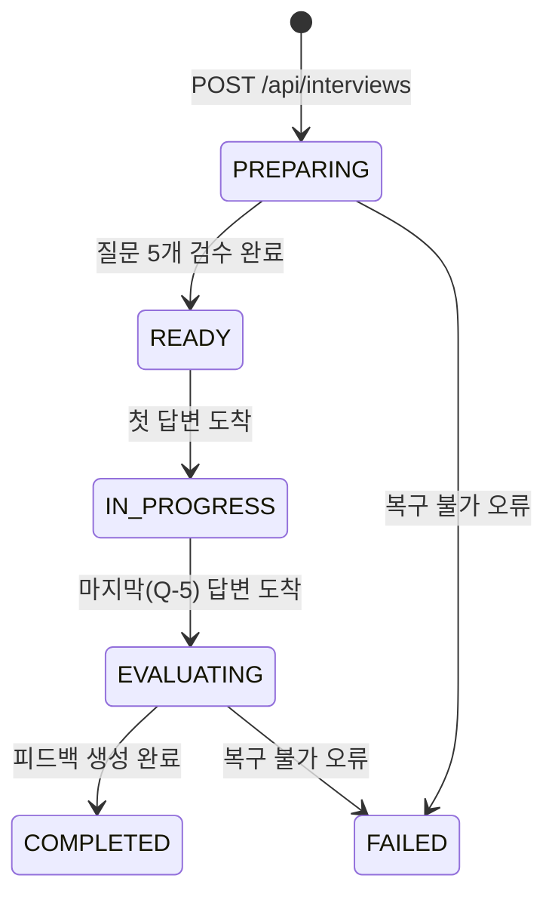
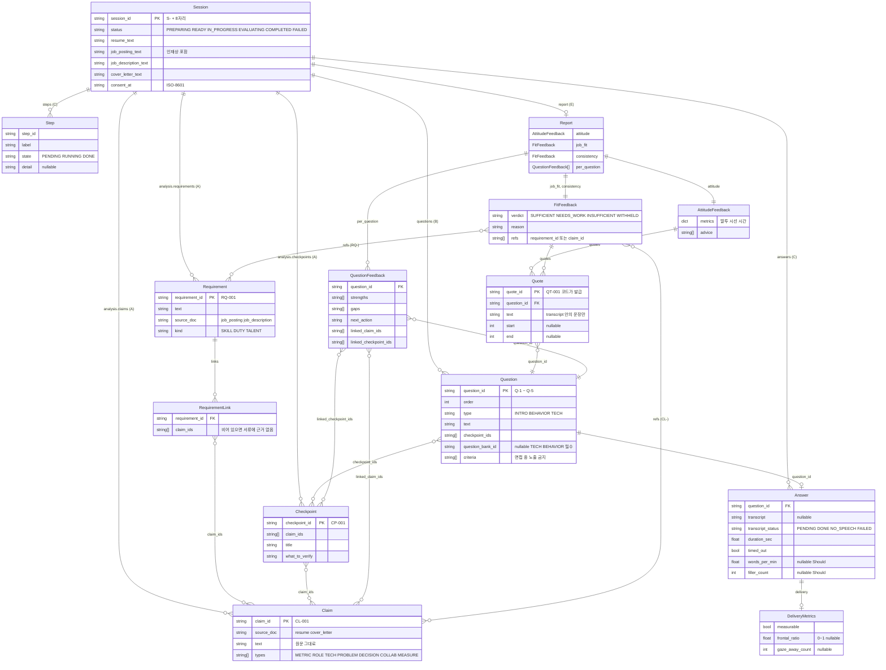

# 04. API 명세·데이터 스키마

한 줄 요약: API 4개의 요청·응답·오류, 세션 상태 전이, State 엔티티 ERD, ID 규칙을 한곳에 모은 개발 계약 요약.
기준: Claude Docs 2026-09-29 버전 (「개발 계약·담당표」 탭, 「화면별 기능정의서」 탭)

관련 문서: docs/01-PRD.md, docs/02-screen-flow.md, docs/03-functional-spec.md, docs/05-architecture.md, docs/06-wbs-schedule.md, docs/07-dev-rules.md, docs/08-test-scenarios.md
예시 응답 JSON: shared/mock/ (README 참고)
Pydantic 원본: `backend/app/schemas/state.py`, `backend/app/schemas/api.py` (C가 관리). 이 문서와 코드가 다르면 Docs가 우선이다.

## 1. 공통 원칙

- 면접 한 번은 세션 하나(`session_id`). 새로고침으로 끊기면 세션을 버리고 처음부터 다시 한다(확정).
- 질문 5개는 준비 단계에서 모두 만든다. 꼬리질문이 없어 면접 중 서버 판단이 없다.
- 오래 걸리는 일(서류 분석, 음성 변환, 피드백 생성)은 요청을 받자마자 응답하고 백그라운드에서 돌린다. 프런트는 `GET /api/interviews/{id}`를 2초 간격으로 부른다.
- 오류 응답 형식: `{"error": {"code": "...", "message": "..."}}`
- 필드명 snake_case, 열거값 대문자 영어. 세션은 메모리에 두며 서버 재시작 시 사라져도 된다.
- 면접 중 API 응답에는 질문의 기대 요소·평가 기준(`criteria`)을 넣지 않는다.

## 2. API 4개 한눈에

| API | 호출 화면 | 하는 일 | 응답 시간 | 성공 코드 |
|---|---|---|---|---|
| `POST /api/interviews` | 2 서류 업로드 | 세션 생성, 백그라운드로 분석·질문 준비 시작 | 즉시 | 201 |
| `GET /api/interviews/{id}` | 3·6 로딩, 4·5 질문 | 상태·단계 진행·질문 5개 조회 | 즉시 | 200 |
| `POST /api/interviews/{id}/answers` | 5 면접 | 질문 1개의 녹음·측정값 업로드 | 즉시(변환은 백그라운드) | 202 |
| `GET /api/interviews/{id}/report` | 7 피드백 | 완성된 피드백 조회 | 즉시 | 200 |

화면 1(시작)은 API를 부르지 않는다.

## 3. API 상세

### 3.1 POST /api/interviews

요청 `multipart/form-data`. 서류 4종 모두 필수, 각 서류는 파일(`*_file`)과 텍스트(`*_text`) 중 하나.

| 필드 | 필수 | 설명 |
|---|---|---|
| `resume_file` 또는 `resume_text` | 필수 | 이력서 |
| `job_posting_file` 또는 `job_posting_text` | 필수 | 채용공고 (인재상 포함) |
| `job_description_file` 또는 `job_description_text` | 필수 | 직무기술서 |
| `cover_letter_file` 또는 `cover_letter_text` | 필수 | 자기소개서 |
| `privacy_consent` | 필수 | `true` |

응답 `201`: `{ "session_id": "S-3f2a9c1e", "status": "PREPARING" }`

| HTTP | code | 상황 | 비고 |
|---|---|---|---|
| 422 | `TEXT_EXTRACTION_FAILED` | 파일에서 텍스트 추출 실패 | `field` 포함. 해당 칸을 텍스트 입력으로 전환 |
| 422 | `MISSING_REQUIRED_DOC` | 필수 서류 누락 | `field` 포함 |
| 422 | `CONSENT_REQUIRED` | 개인정보 동의 없음 | |

### 3.2 GET /api/interviews/{session_id}

응답 `200`:

```json
{
  "session_id": "S-3f2a9c1e",
  "status": "PREPARING",
  "steps": [
    { "step_id": "read_posting", "label": "채용공고 읽는 중", "state": "DONE", "detail": "요구사항 16개 확인" },
    { "step_id": "link", "label": "공고와 경험 연결 중", "state": "RUNNING", "detail": null }
  ],
  "questions": null
}
```

| 필드 | 설명 |
|---|---|
| `status` | 6.의 상태값 |
| `steps` | 화면 3(PREPARING): `read_posting`, `read_resume`, `link`, `checkpoints`, `questions`, `review`. 화면 6(EVALUATING): `transcribe`, `attitude`, `job_fit`, `consistency`, `compose`. 각 항목 `state`는 `PENDING`/`RUNNING`/`DONE`, `detail`은 null 가능 |
| `questions` | READY 이후 5개 `[{ question_id, order, type, text }]`. 그 전에는 null. 기대 요소·평가 기준·연결 정보 없음 |
| `error` | FAILED일 때 이유. 화면 3은 진행 60초 초과도 「다시 시도」로 처리 |

오류: Docs에 정의 없음 (확인 필요 참고).

### 3.3 POST /api/interviews/{session_id}/answers

질문 한 개에 한 번 호출. 요청 `multipart/form-data`.

| 필드 | 예 | 설명 |
|---|---|---|
| `question_id` | `Q-2` | 대상 질문 |
| `audio` | webm 파일 | 마이크가 끊기면 없을 수 있음 |
| `duration_sec` | `63.4` | 답변 시간(초) |
| `timed_out` | `false` | 1분 30초 초과로 자동으로 넘어갔으면 true |
| `delivery_metrics` | `{"measurable": true, "frontal_ratio": 0.81, "gaze_away_count": 3}` | 프런트가 계산한 시선 측정값. 점수 미반영 |

응답 `202`: `{ "question_id": "Q-2", "received": true, "next_question_id": "Q-3", "status": "IN_PROGRESS" }`

- 마지막(Q-5)을 받으면 `next_question_id`는 null, `status`는 `EVALUATING`.
- 음성은 서버 STT로 변환(답변 종료 후 파일 변환)하고 끝나면 삭제. 무음이거나 변환 실패면 `transcript_status`가 `NO_SPEECH`/`FAILED`가 되고 면접은 그대로 진행.
- 같은 `question_id`로 다시 오면 이전 응답을 그대로 돌려준다(재전송 안전).

| HTTP | code | 상황 |
|---|---|---|
| 404 | `SESSION_NOT_FOUND` | 없는 세션 |
| 409 | `NOT_IN_PROGRESS` | 진행 가능한 상태가 아님 |
| 422 | `UNKNOWN_QUESTION` | 없는 `question_id` |

### 3.4 GET /api/interviews/{session_id}/report

`status`가 `COMPLETED`가 아니면 `409 NOT_READY`. 응답 모양은 shared/mock/report.json.

| 최상위 키 | 설명 |
|---|---|
| `session_id` | 세션 ID |
| `attitude` | `metrics`(speech, gaze, time), `advice[]`, `quotes[]`. 판정·점수 없음 |
| `job_fit`, `consistency` | `verdict`, `reason`, `quotes[]`, `refs[]` (RQ-/CL- ID) |
| `per_question` | 질문별 `strengths`, `gaps`, `next_action`, `linked_claim_ids`, `linked_checkpoint_ids` |
| `questions` | `question_id`, `type`, `text`, `answer_text` (화면 7이 다른 API를 부르지 않도록 동봉) |
| `claims`, `checkpoints` | 연결 정보 표시용 `claim_id`+`text`, `checkpoint_id`+`title` |

- 모든 `quotes`는 답변 텍스트에 실제로 있는 문장만 남기고, 없는 인용은 코드가 제거한다.
- `NO_SPEECH`·`FAILED` 질문은 `answer_text`가 null이고 판정에서 빠진다.

## 4. 오류 코드 모음

| HTTP | code | API | 화면 동작 |
|---|---|---|---|
| 422 | `TEXT_EXTRACTION_FAILED` | POST /interviews | 해당 칸을 텍스트 입력 탭으로 전환 |
| 422 | `MISSING_REQUIRED_DOC` | POST /interviews | 비어 있는 칸 안내 |
| 422 | `CONSENT_REQUIRED` | POST /interviews | 동의 안내 |
| 404 | `SESSION_NOT_FOUND` | POST /answers | 처음부터 다시 |
| 409 | `NOT_IN_PROGRESS` | POST /answers | - |
| 422 | `UNKNOWN_QUESTION` | POST /answers | - |
| 409 | `NOT_READY` | GET /report | 완료 전 |

## 5. 세션 상태 전이



| status | 뜻 | 화면 | 다음 상태로 가는 조건 |
|---|---|---|---|
| `PREPARING` | 서류 분석·질문 준비 중 | 3. AI 분석 로딩 | 질문 5개 검수 완료 |
| `READY` | 질문 준비 완료, 면접 시작 전 | 4. 면접대기실 | 첫 답변 도착 |
| `IN_PROGRESS` | 면접 진행 중 | 5. 면접 | 마지막(5번) 답변 도착 |
| `EVALUATING` | 답변 변환·분석·피드백 생성 중 | 6. 분석 로딩 | 피드백 생성 완료 |
| `COMPLETED` | 피드백 준비 완료 | 7. 면접 피드백 | 없음 |
| `FAILED` | 복구 불가 오류 | 다시 시도 버튼 | 없음 |

FAILED로 가는 경로는 Docs가 상태표에 「복구 불가 오류」로만 적어, 위 그림의 PREPARING/EVALUATING 화살표는 화면 3·6의 예외 문구에서 읽은 것이다(확인 필요 참고).

## 6. 핵심 엔티티 ERD

State 스키마(`backend/app/schemas/state.py`) 기준. 리스트 필드(`claim_ids` 등)는 관계선으로도 표시했다. 채우는 담당: 준비 단계 A·B, 면접 단계 C, 피드백 E.



`Analysis`(requirements, claims, checkpoints, links)는 `Session.analysis` 하나로 묶인 컨테이너라 ERD에서는 각 엔티티가 Session에 직접 붙는 것으로 단순화했다. 질문 하나에 답변 하나가 대응하므로 `turn_id`는 쓰지 않는다.

## 7. ID 규칙

모든 ID는 코드가 만든다. LLM은 이미 있는 ID를 참조만 하고, 코드가 그 ID가 실제로 있는지 검사한다.

| ID | 형식 | 예시 | 만드는 곳 |
|---|---|---|---|
| `session_id` | `S-` + 8자리 | S-3f2a9c1e | 세션 생성 API |
| `requirement_id` | `RQ-` + 3자리 | RQ-004 | 공고·직무기술서 분석 (A) |
| `claim_id` | `CL-` + 3자리 | CL-001 | 지원자 분석 후처리 (A) |
| `checkpoint_id` | `CP-` + 3자리 | CP-001 | 지원자 분석 후처리 (A) |
| `question_id` | `Q-1` ~ `Q-5`, 고정 순서 | Q-4 | 질문 계획 (B) |
| `question_bank_id` | 기술 `TECH-주제-3자리`, 인성 `COMP-역량-3자리` | TECH-RAG-001 | 질문 은행 JSON (B) |
| `quote_id` | `QT-` + 3자리 | QT-007 | 인용 검증기 (E) |

질문 고정 순서: Q-1 INTRO(자기소개), Q-2 BEHAVIOR(인성), Q-3 BEHAVIOR(인성), Q-4 TECH(기술), Q-5 TECH(기술).

## 8. 확인 필요

Docs 안의 모순·빈틈. 임의로 메우지 않고 팀 확인을 기다린다.

1. `FAILED` 재시도: 화면 3·6은 「다시 시도」 버튼과 「입력 서류 유지/답변 유지」를 요구하지만 재시도 API가 없다(API는 4개뿐). 화면 6의 재시도가 같은 세션 재평가인지 새 세션인지 미정.
2. 「다시 연습하기」(같은 서류로 질문 재생성 후 화면 4로)에 대응하는 API가 없다. `POST /api/interviews`는 서류 4종을 다시 받는 형식이다.
3. `GET /{id}` 응답의 `error` 필드는 State(`InterviewState`)에 없고 형식(code/message 여부)도 정의되지 않았다. `GET /{id}`, `GET /report`의 404 `SESSION_NOT_FOUND` 여부도 명시되지 않았다.
4. `report.json`은 `Report` 모델(attitude, job_fit, consistency, per_question)에 `session_id`, `questions`, `claims`, `checkpoints`가 추가된 형태인데 응답용 모델이 State에 정의되어 있지 않다(`schemas/api.py`로 예상). `refs`의 `RQ-` ID 문구를 화면에 그릴 `requirements` 정보도 응답에 없다.
5. 요청 `delivery_metrics`(JSON 문자열)와 State `Answer.delivery`, 요청 `privacy_consent`와 State `consent_at`(서버가 시각 기록으로 추정), `words_per_min`/`filler_count`의 Should 여부가 이름·형식으로만 대응한다.
6. `audio` 파일 형식은 webm이 예시로만 나오고 C↔D 조율 항목으로 남아 있다. 마이크가 끊겨 `audio`가 없을 때의 보내는 방식도 미정.
7. 평가 시작 시점은 「마지막 답변과 STT 변환이 모두 끝난 뒤」인데, status는 마지막 답변 수신 즉시 `EVALUATING`이 된다. 변환 대기 중 상태 표시는 `steps[transcribe]`로 추정된다.
8. 영역 판정 집계 규칙(질문 피드백이 영역 판정 `verdict`가 되는 방식)은 킥오프 미결. 판정 라벨은 화면정의서에서 「제안」(충분/보완 필요/미흡/판단 보류)이며 State 값은 SUFFICIENT/NEEDS_WORK/INSUFFICIENT/WITHHELD.
9. 질문 음성(TTS)을 서버 모델로 하면 음성 반환 API가 필요해 API가 5개가 된다. 브라우저 TTS면 4개 유지(미정).
10. `NO_SPEECH`/`FAILED` 질문의 `per_question` 피드백 내용과 `attitude.metrics.speech` 계산 제외 여부는 정의되지 않았다.
11. `report.json` 예시의 `time.per_question`은 Docs에서 질문 1개만 보이는데 전체 5개인지 명시되지 않았다.
12. 화면 3의 60초 초과 「다시 시도」 처리는 프런트 타이머인지 서버 FAILED 전환인지 명시되지 않았다.
