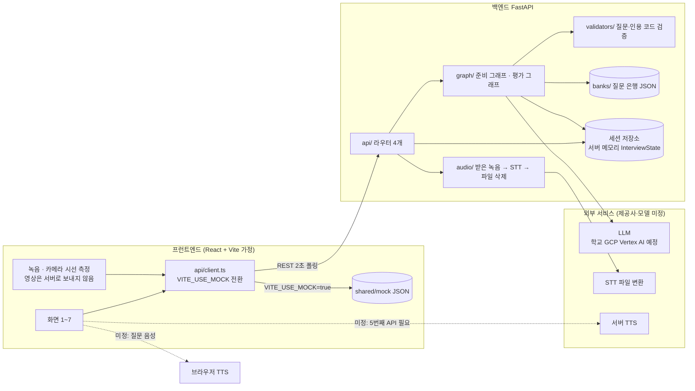
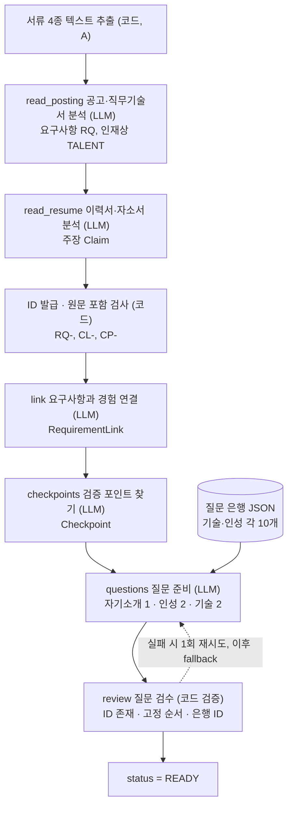
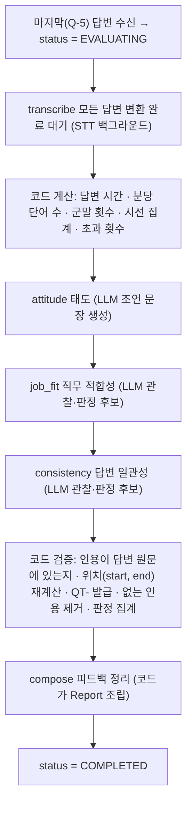
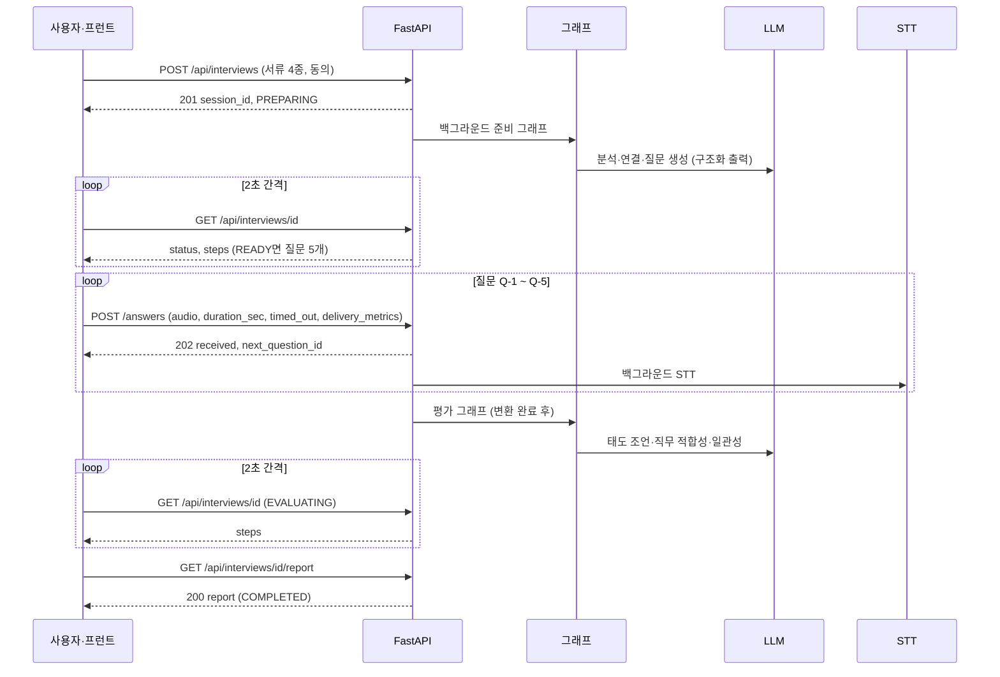
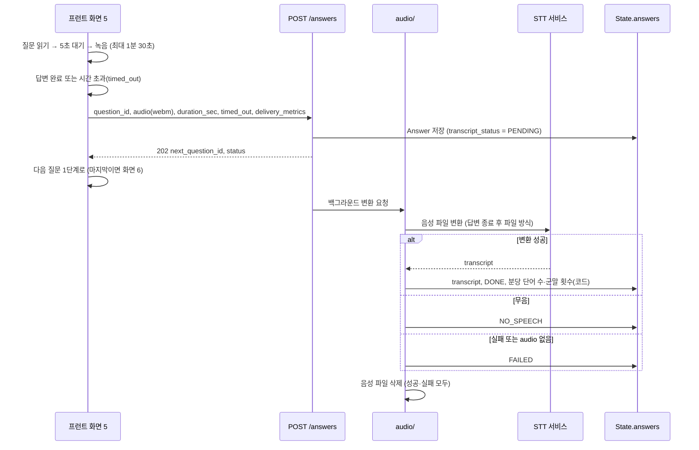
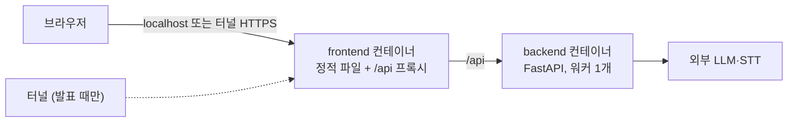

# 05. 아키텍처

한 줄 요약: 프런트(React+Vite 가정) - FastAPI - 준비·평가 그래프 - 외부 LLM/STT(/TTS) 구성과, LLM은 관찰·생성만 하고 코드가 계산·검증하는 책임 경계.
기준: Claude Docs 2026-09-29 버전 (「개발 계약·담당표」 탭, 「화면별 기능정의서」 탭)

관련 문서: docs/01-PRD.md, docs/02-screen-flow.md, docs/03-functional-spec.md, docs/04-api-schema.md, docs/06-wbs-schedule.md, docs/07-dev-rules.md, docs/08-test-scenarios.md

## 0. 미정 항목 (그림의 점선·주석)

| 항목 | 상태 | 표기 |
|---|---|---|
| 질문 음성(TTS): 브라우저 기능 vs 서버 모델(Vertex AI TTS) | 미정. 서버면 음성 반환 API가 필요해 API가 5개가 됨 | 점선 |
| LLM·STT 제공사와 모델명 | 미정. 학교 GCP Vertex AI를 쓸 수 있을 예정이나 모델명은 콘솔에서 확인 후 확정 | 점선, 「제공사 미정」 |
| 프런트 스택 | React + Vite 가정(초안) | 「가정」 표기 |
| 세션 저장소 | 확정: 서버 메모리, 재시작 시 소실 허용 | 실선 |
| 실행 환경 | 확정: 개발은 로컬 Docker, 발표 때만 터널로 HTTPS 주소 공개 (9절) | 실선 |

## 1. 시스템 구성도

- 프런트는 화면 5에서 질문 텍스트 표시와 음성 재생, 5초 대기, 녹음, 1분 30초 타이머, 시선 측정(정면 유지 비율·이탈 횟수)을 맡는다.
- 백엔드는 API 4개, State 관리, 그래프 실행, 녹음 수신→STT→삭제를 맡는다.
- 브라우저 TTS와 서버 TTS 둘 다 점선이다. 결정 전에는 프런트가 질문 텍스트를 항상 화면에 보여 TTS가 실패해도 진행할 수 있다(화면 5 예외).

## 2. 준비 파이프라인 (READY까지)

POST /api/interviews 이후 백그라운드로 실행. steps 6개가 화면 3의 진행 표시가 된다. 담당: A(분석), B(질문), C(그래프 연결).

## 3. 평가 파이프라인 (COMPLETED까지)

마지막 답변과 STT 변환이 모두 끝난 뒤 시작(C↔E 조율 항목). steps 5개가 화면 6의 진행 표시.

## 4. 시퀀스: 준비에서 리포트까지

## 5. 면접 중 한 질문의 녹음 → 업로드 → 백그라운드 STT → 삭제

프런트 화면 5의 질문 한 개 흐름과 백엔드 audio/ 흐름. 화면은 업로드 응답(202)을 받으면 STT를 기다리지 않고 다음 질문으로 넘어간다. 실시간 자막은 없다(확정).

- 영상은 서버로 보내지 않는다. 시선 측정값만 `delivery_metrics`로 전송(점수 미반영).
- Live 스트리밍은 하지 않는다(확정). 새로고침하면 세션을 버린다(확정).
- 삭제 시점은 「변환 후」(확정)이며, 실패 시 파일을 남길지는 Docs에 명시가 없다(확인 필요).

## 6. 책임 경계 표

| 구성요소 | 하는 일 | 하지 않는 일 |
|---|---|---|
| LLM | 서류에서 요구사항·주장·검증 포인트 관찰, 요구사항과 경험 연결, 질문 문장 생성, 판정 후보와 이유·조언 문장 생성 (모두 Pydantic 구조화 출력) | ID 발급, 시간·횟수·비율 계산, 인용 위치 계산, 인용 존재 검증, 판정 집계, 면접 중 질문 변경 |
| 코드(노드·validators) | ID 발급, LLM이 참조한 ID의 존재 검사, Claim 원문 포함 검사, 질문 5개 고정 순서·은행 ID 검증, 답변 시간·분당 단어 수·군말 횟수·시선 집계, 인용 원문 검사와 `start`/`end` 계산, 판정 집계, Report 조립, LLM 실패 시 1회 재시도 후 fallback | 서류 내용 해석, 문장 생성 |
| 프런트 | 화면 1~7, 질문 표시·음성 재생, 5초 대기, 녹음·타이머, 카메라 시선 측정, 업로드, 2초 폴링, 열거값→화면 문구 변환 | 점수·판정 계산, 영상 서버 전송, 면접 중 피드백 표시 |
| FastAPI / audio | API 4개, 백그라운드 작업 시작, 녹음 수신→STT→삭제, 세션 State 저장(메모리) | 질문 기대 요소·평가 기준을 면접 중 응답에 포함, 음성 파일 장기 보관 |
| STT | 음성 파일을 텍스트로 변환 | 분석·평가 |
| 세션 저장소 | InterviewState 보관(서버 재시작 시 소실 허용) | 영구 저장, 이어하기 |

원칙 요약: LLM은 관찰·생성, 코드는 계산·검증. 코드로 계산할 수 있는 것은 LLM에게 시키지 않고, 답변 텍스트에 없는 문장은 코드가 인용에서 버린다.

## 7. 담당별 위치

| 담당 | 백엔드 | 화면 |
|---|---|---|
| A 서류 입력·분석 | nodes/prep (분석) | 1, 2 |
| B 질문 준비·로딩 | nodes/prep (질문), banks, validators (질문·인용) | 3, 6 (단계 진행 컴포넌트) |
| C 세션·통합 | schemas, graph, api, audio | (없음) |
| D 면접 화면·전체 UI | (프런트 시선 계산) | 프런트 뼈대, api/client.ts, 4, 5 |
| E 피드백 | nodes/evaluate (인용 검증 함수는 B의 validators를 호출) | 7 |

## 8. 확인 필요

1. TTS 방식(브라우저 vs 서버)에 따라 API 개수와 프런트·백엔드 경계가 달라진다. 킥오프 결정 필요.
2. LLM·STT 제공사, 모델, 호출 한도 미정. 그래프의 노드별 모델 분리 여부도 미정.
3. 준비 파이프라인의 6개 단계(steps)와 그래프 노드의 대응, 「ID 발급」이 어느 step에 속하는지는 Docs에 명시가 없다. 위 그림은 ID 표(A가 만든다)를 근거로 배치한 추정이다.
4. 평가 파이프라인 내부 순서(attitude → job_fit → consistency)는 steps 순서에서 읽은 것이며 병렬 실행 여부는 정해지지 않았다.
5. 변환 실패 시 음성 파일 삭제 여부, 그리고 재시도·타임아웃 정책은 미정.
6. 프런트 스택(React + Vite)은 가정이다.

## 9. 실행 환경 (Docker)

개발은 로컬 Docker(`docker compose`)로, 발표 때만 터널로 HTTPS 주소를 임시 공개한다. (확정) 브라우저는 `localhost` 또는 HTTPS에서만 마이크·카메라를 허용하므로, 로컬 개발에는 HTTPS가 필요 없고 발표 때만 터널이 필요하다.

| 항목 | 규칙 |
|---|---|
| 접속 주소 | 프런트 컨테이너가 `/api`를 백엔드로 프록시해 주소를 하나로 만든다. 터널은 프런트 포트 하나만 연다. CORS 문제도 줄어든다. (제안) |
| 세션 메모리 | 백엔드 워커는 1개, 컨테이너도 1개로 고정한다. 여러 개면 세션이 서로 보이지 않는다. 컨테이너를 재시작하면 세션이 사라진다(허용). (제안) |
| 음성 임시 파일 | 컨테이너 임시 폴더에 두고 STT 후 삭제한다. 볼륨은 만들지 않는다. (제안) |
| LLM 인증 | 컨테이너 안에는 개인 gcloud 로그인이 없다. 제공사 확정 후 키나 서비스 계정 키 파일을 런타임에 주입하고, 이미지와 저장소에는 넣지 않는다. (미정) |
| 프런트 환경변수 | `VITE_*`는 빌드 시점 값이라 바꾸면 프런트 이미지를 다시 빌드해야 한다. ([docs/07-dev-rules.md](07-dev-rules.md) 7절) |
| 터널 | 발표 전 리허설에서 터널 주소로 마이크·카메라가 허용되는지 확인한다. 주소는 실행마다 바뀔 수 있다. (제안) |
