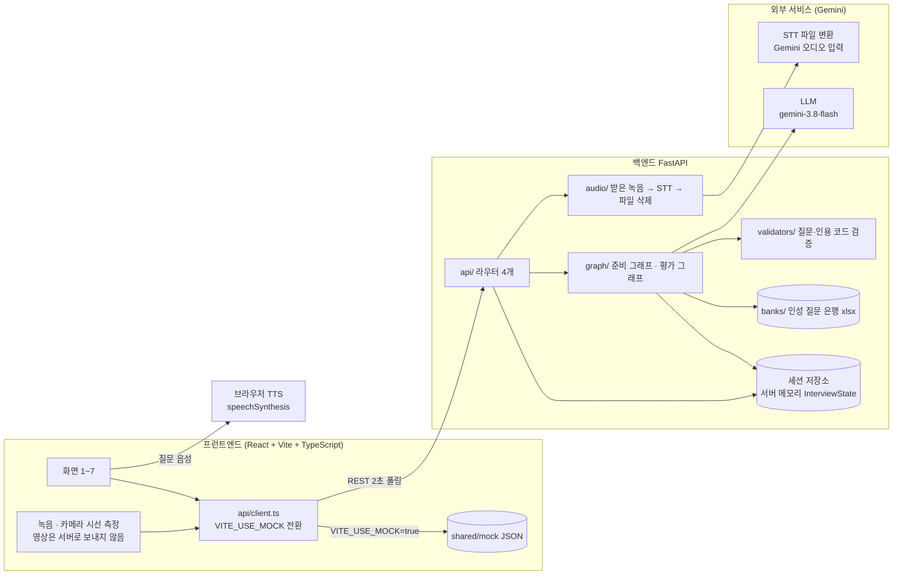
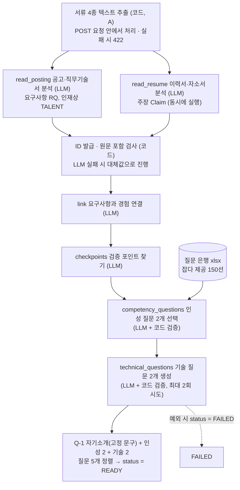
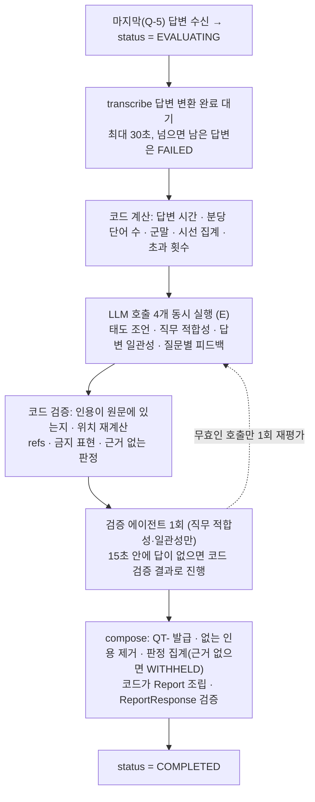
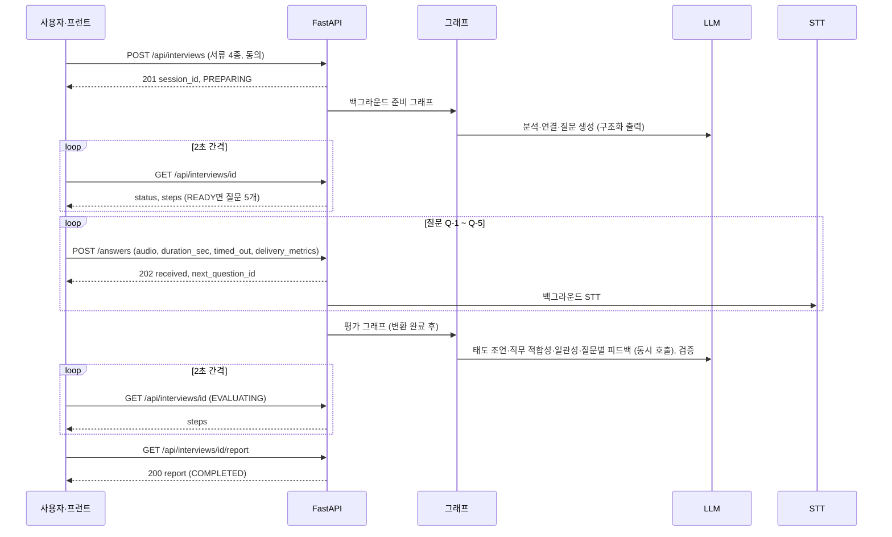
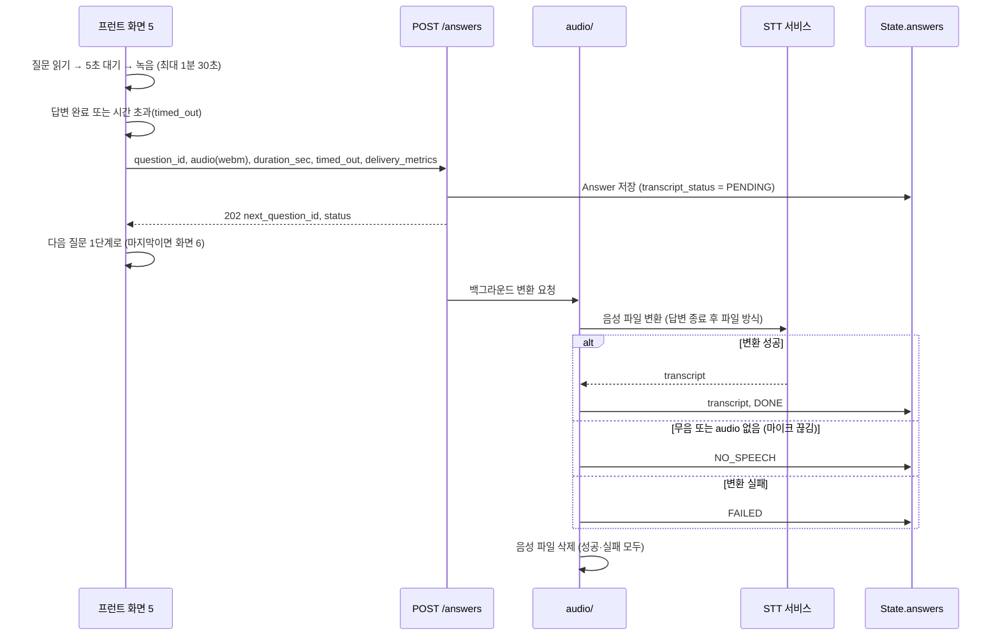
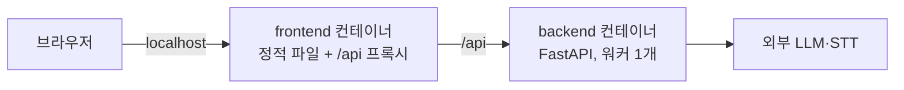

# 05. 아키텍처

한 줄 요약: 프런트(React+Vite) - FastAPI - 준비·평가 그래프 - 외부 LLM/STT(Gemini) 구성과, LLM은 관찰·생성만 하고 코드가 계산·검증하는 책임 경계.
기준: 2026-10-01 구현 기준 (원본: Claude Docs 2026-09-29 버전)

구현 반영: 본문의 「미정」·「(제안)」은 기획 단계 표시다. 구현에서 해결·채택된 내용은 각 문서의 「결정 결과」 절과 [docs/README.md](README.md)의 구현 현황이 우선한다.

관련 문서: docs/01-PRD.md, docs/02-screen-flow.md, docs/03-functional-spec.md, docs/04-api-schema.md, docs/06-wbs-schedule.md, docs/07-dev-rules.md, docs/08-test-scenarios.md

## 0. 결정 결과 (그림의 점선·주석이던 항목)

| 항목 | 결과 |
|---|---|
| 질문 음성(TTS) | 확정: 브라우저 `speechSynthesis`. 서버 TTS와 5번째 API 없음 |
| LLM·STT 제공사와 모델명 | 확정: Gemini(`gemini-3.8-flash`, 역할별로 `INTERVIEW_MODEL_<역할>`로 교체 가능). 연결은 Vertex AI 또는 API 키. 학교 Vertex 호출 한도는 미확인 |
| 프런트 스택 | 확정: React + Vite + TypeScript |
| 세션 저장소 | 확정: 서버 메모리, 재시작 시 소실 허용 |
| 실행 환경 | 개발은 로컬 Docker. 발표는 **사전 녹화한 시연 영상**을 쓰므로 터널은 사용하지 않는다 |

## 1. 시스템 구성도



- 프런트는 화면 5에서 질문 텍스트 표시와 음성 재생, 5초 대기, 녹음, 1분 30초 타이머, 시선 측정(정면 유지 비율·이탈 횟수)을 맡는다.
- 백엔드는 API 4개, State 관리, 그래프 실행, 녹음 수신→STT→삭제를 맡는다.
- 질문 음성은 브라우저 TTS로 확정했다(서버 TTS 없음). 프런트가 질문 텍스트를 항상 화면에 보여 TTS가 실패해도 진행할 수 있다(화면 5 예외).

## 2. 준비 파이프라인 (READY까지)

POST /api/interviews 이후 백그라운드로 실행. 그림의 6개 단계(read_posting ~ technical_questions)가 화면 3의 진행 표시가 된다. 담당: A(분석), B(질문), C(그래프 연결).



## 3. 평가 파이프라인 (COMPLETED까지)

마지막 답변과 STT 변환이 모두 끝난 뒤 시작한다. steps 5개(transcribe ~ compose)는 화면 6의 진행 표시이고, 실제 실행 순서는 아래 그림과 같다(`nodes/evaluate/runner.py`).



## 4. 시퀀스: 준비에서 리포트까지



## 5. 면접 중 한 질문의 녹음 → 업로드 → 백그라운드 STT → 삭제

프런트 화면 5의 질문 한 개 흐름과 백엔드 audio/ 흐름. 화면은 업로드 응답(202)을 받으면 STT를 기다리지 않고 다음 질문으로 넘어간다. 실시간 자막은 없다(확정).



- 영상은 서버로 보내지 않는다. 시선 측정값만 `delivery_metrics`로 전송(점수 미반영).
- Live 스트리밍은 하지 않는다(확정). 새로고침하면 세션을 버린다(확정).
- 삭제 시점은 「변환 후」(확정)이며, 변환 성공·무음·실패 모두 파일을 삭제한다(구현·테스트됨). 분당 단어 수·군말 횟수는 평가 단계에서 코드가 transcript로 계산한다.

## 6. 책임 경계 표

| 구성요소 | 하는 일 | 하지 않는 일 |
|---|---|---|
| LLM | 서류에서 요구사항·주장·검증 포인트 관찰, 요구사항과 경험 연결, 질문 문장 생성, 판정 후보와 이유·조언 문장 생성 (모두 Pydantic 구조화 출력) | ID 발급, 시간·횟수·비율 계산, 인용 위치 계산, 인용 존재 검증, 판정 집계, 면접 중 질문 변경 |
| 코드(노드·validators) | ID 발급, LLM이 참조한 ID의 존재 검사, Claim 원문 포함 검사, 질문 5개 고정 순서·은행 ID 검증, 답변 시간·분당 단어 수·군말 횟수·시선 집계, 인용 원문 검사와 `start`/`end` 계산, 판정 집계, Report 조립, LLM 실패 시 1회 재시도 후 fallback | 서류 내용 해석, 문장 생성 |
| 프런트 | 화면 1~7, 질문 표시·음성 재생, 5초 대기, 녹음·타이머, 카메라 시선 측정, 업로드, 2초 폴링, 열거값→화면 문구 변환 | 점수·판정 계산, 영상 서버 전송, 면접 중 피드백 표시 |
| FastAPI / audio | API 4개, 백그라운드 작업 시작, 녹음 수신→STT→삭제, 세션 State 저장(메모리) | 질문 기대 요소·평가 기준을 면접 중 응답에 포함, 음성 파일 장기 보관 |
| STT | 음성 파일을 텍스트로 변환 | 분석·평가 |
| 세션 저장소 | InterviewState 보관(서버 재시작 시 소실 허용) | 영구 저장, 이어하기 |

원칙 요약: LLM은 관찰·생성, 코드는 계산·검증. 코드로 계산할 수 있는 것은 LLM에게 시키지 않고, 답변 텍스트에 없는 문장은 코드가 인용에서 버린다.

## 7. 담당별 위치

| 담당 | 백엔드 | 화면 |
|---|---|---|
| A 서류 입력·분석 | nodes/prep (분석) | 1, 2 |
| B 질문 준비·로딩 | nodes/prep (질문), banks, validators (질문·인용) | 3, 6 (단계 진행 컴포넌트) |
| C 세션·통합 | schemas, graph, api, audio | (없음) |
| D 면접 화면·전체 UI | (프런트 시선 계산) | 프런트 뼈대, api/client.ts, 4, 5 |
| E 피드백 | nodes/evaluate (인용 검증 함수는 B의 validators를 호출) | 7 |

## 8. 결정 결과 (확인 필요였던 항목)

1. TTS: 브라우저 방식으로 확정, API 4개 유지.
2. LLM·STT: Gemini로 확정. 노드별 모델·추론 수준은 `INTERVIEW_MODEL_<역할>`, `INTERVIEW_THINKING_<역할>`로 분리 가능.
3. 준비 파이프라인 6단계는 서류 읽기(`read_posting`, `read_resume`), 연결(`link`), 검증 포인트(`checkpoints`), 인성 질문 선택(`competency_questions`), 기술 질문 생성(`technical_questions`)으로 구현되어 `graph/prepare.py`가 A의 `run_analysis` 진행 신호로 갱신한다.
4. 평가 파이프라인은 E의 `evaluate_state`가 순서대로 한 번에 실행한다(병렬 아님). `steps`는 `transcribe` → `attitude` → `job_fit` → `consistency` → `compose` 순서로 표시한다.
5. 변환 실패 시 음성 파일은 항상 삭제한다. 변환 한 건은 25초, 평가 시작 전 변환 대기는 최대 30초로 제한하고 초과분은 `FAILED`로 처리한다. 재시도 API는 없다.
6. 프런트 스택은 React + Vite + TypeScript로 확정.

## 9. 실행 환경 (Docker)

개발은 로컬 Docker(`docker compose`)로 한다. 발표는 사전 녹화한 시연 영상을 쓰므로 터널은 쓰지 않는다. (확정) 브라우저는 `localhost` 또는 HTTPS에서만 마이크·카메라를 허용하므로, 로컬 실행에는 HTTPS가 필요 없다.



| 항목 | 규칙 |
|---|---|
| 접속 주소 | 프런트 컨테이너가 `/api`를 백엔드로 프록시해 주소를 하나로 만든다. 필요하면 터널도 프런트 포트 하나만 열면 된다. CORS 문제도 줄어든다. (구현됨) |
| 세션 메모리 | 백엔드 워커는 1개, 컨테이너도 1개로 고정한다. 여러 개면 세션이 서로 보이지 않는다. 컨테이너를 재시작하면 세션이 사라진다(허용). (구현됨) |
| 음성 임시 파일 | 컨테이너 임시 폴더에 두고 STT 후 삭제한다. 볼륨은 만들지 않는다. (구현됨) |
| LLM 인증 | 컨테이너 안에는 개인 gcloud 로그인이 없다. `.env`의 API 키(`GEMINI_API_KEY`)를 `env_file`로 런타임에 주입하고, 이미지와 저장소에는 넣지 않는다. |
| 프런트 환경변수 | `VITE_*`는 빌드 시점 값이라 바꾸면 프런트 이미지를 다시 빌드해야 한다. ([docs/07-dev-rules.md](07-dev-rules.md) 7절) |
| 터널 | 사용하지 않는다(사전 녹화 영상으로 발표). 필요하면 터널 주소로 마이크·카메라가 허용되는지 먼저 확인한다. |

## 10. 백엔드 폴더 구조와 실행

폴더 뼈대(W-02)의 기준이다. 구조는 C가 확인해 확정했다.

### 전체 폴더 트리

```text
proof_interview/
├─ backend/
│  ├─ Dockerfile
│  ├─ requirements.txt
│  └─ app/
│     ├─ main.py              FastAPI 앱 생성, 라우터 등록, CORS (C)
│     ├─ api/                 엔드포인트 4개 (C)
│     │  ├─ interviews.py     POST /api/interviews, GET /api/interviews/{id}
│     │  ├─ answers.py        POST /api/interviews/{id}/answers
│     │  └─ report.py         GET /api/interviews/{id}/report
│     ├─ schemas/             Pydantic: state.py, api.py (C)
│     ├─ graph/               준비 그래프·평가 그래프 연결 (C)
│     ├─ audio/               녹음 수신 → STT → 파일 삭제 (C)
│     ├─ store.py             세션 State 메모리 저장 (C)
│     ├─ nodes/
│     │  ├─ prep/             분석(A), 질문 생성(B) 노드
│     │  └─ evaluate/         태도·직무 적합성·일관성 노드 (E)
│     ├─ banks/               질문 은행 JSON (B)
│     └─ validators/          질문 검증, 인용 검증 (B)
├─ frontend/
│  ├─ Dockerfile
│  └─ src/
│     ├─ api/                 client.ts, mock 전환 (D)
│     ├─ pages/               화면 1~7
│     └─ components/          progress, interview, report, upload
├─ shared/
│  └─ mock/                   mock JSON 6개 + 샘플 서류
├─ docker-compose.yml         (C)
├─ .env.example
└─ docs/
```

### 엔드포인트와 파일 대응

| API | 파일 | 하는 일 |
|---|---|---|
| `POST /api/interviews` | `api/interviews.py` | 세션 생성 → 준비 그래프를 백그라운드로 시작 → 201 |
| `GET /api/interviews/{id}` | `api/interviews.py` | 상태, `steps`, 질문 5개 조회 |
| `POST /api/interviews/{id}/answers` | `api/answers.py` | 녹음 저장 → `audio/`에 변환 요청 → 202 |
| `GET /api/interviews/{id}/report` | `api/report.py` | 완성된 Report 조회 |

### nodes와 graph의 역할

| 폴더 | 역할 | 예 |
|---|---|---|
| `nodes/` | 작업 단위. 입력 State를 받아 일부를 채워 돌려주는 함수 하나 | `read_posting`, `questions`, `attitude` |
| `graph/` | 연결. 노드 순서와 실패 시 재시도·fallback을 정의 | 준비 그래프(6단계), 평가 그래프(5단계) |

노드는 다른 노드를 직접 부르지 않고, 순서는 `graph/`에서만 정한다. A·B·E는 자기 노드만 만들고 C가 그래프에 연결한다.

예외: E의 평가는 `evaluate_state` 하나가 태도·직무 적합성·일관성·질문별 호출을 동시에 처리한다. 순서대로 부르면 60초를 넘기기 때문이다. `graph/evaluate.py`는 STT 대기 → `evaluate_state` → 결과 저장만 정한다. (확정)

### 백그라운드 작업과 실행

- 준비 그래프, STT 변환, 평가 그래프는 응답을 보낸 뒤 FastAPI `BackgroundTasks`로 돌린다. (확정)
- 세션은 메모리(`store.py`)에 있으므로 uvicorn 워커는 1개로 고정한다. (구현됨)

```bash
uvicorn app.main:app --host 0.0.0.0 --port 8000
```

- Docker에서는 `docker compose up`으로 프런트와 함께 실행한다. 프런트 컨테이너가 `/api`를 `backend:8000`으로 프록시한다. (제안)
- `api/` 3파일 분할, `store.py` 위치, `BackgroundTasks` 사용, 포트 8000은 확정이다. (확정)
