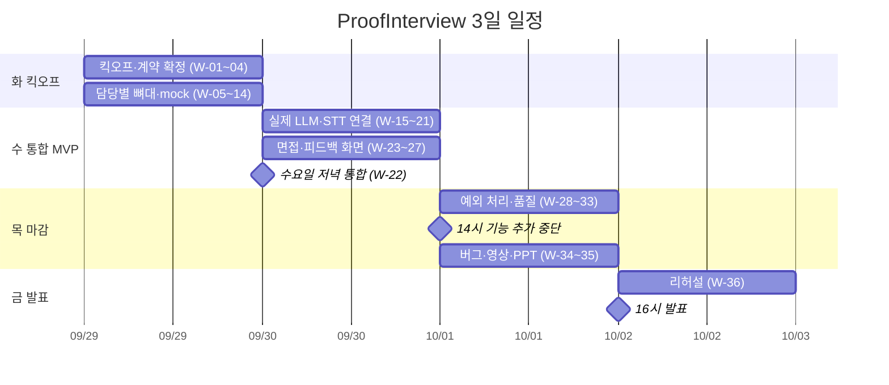
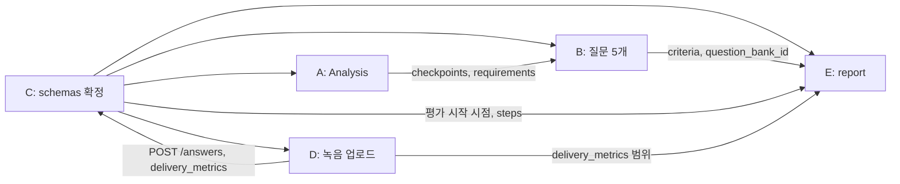

# 06. WBS·담당표·일정

> 한 줄 요약: 5명(A~E)이 각자 백엔드와 화면을 끝까지 맡아 화 9/29 킥오프 → 수 9/30 저녁 통합 MVP → 목 10/1 14시 기능 추가 중단 → 금 10/2 16시 발표로 가는 작업 분해표다.
>
> 기준: Claude Docs 2026-09-29 버전 (「개발 계약·담당표」 탭이 최신 정의. 충돌하면 Docs를 따른다)
>
> 관련 문서: [docs/01-PRD.md](01-PRD.md) · [docs/02-screen-flow.md](02-screen-flow.md) · [docs/03-functional-spec.md](03-functional-spec.md) · [docs/04-api-schema.md](04-api-schema.md) · [docs/05-architecture.md](05-architecture.md) · [shared/mock/README.md](../shared/mock/README.md)

## 1. 담당과 범위

| 담당 | 이름 | 영역 | 백엔드 | 화면 |
|---|---|---|---|---|
| A | (킥오프에서 기입) | 서류 입력·분석 | 문서 텍스트 추출, 공고·직무기술서 분석, 이력서·자소서 분석, 요구사항-경험 연결 | 1 시작, 2 서류 업로드 |
| B | (킥오프에서 기입) | 질문 준비·로딩 | 질문 은행, 자기소개 질문, 질문 5개 고정 순서 배정, 질문 코드 검증 | 3 AI 분석 로딩, 6 분석 로딩 (단계 진행 공통 컴포넌트) |
| C | (킥오프에서 기입) | 세션·통합 | State·그래프, API 4개, 녹음 수신 → 서버 STT → 파일 삭제, 평가 실행 연결 | 프런트 뼈대 (라우팅, API 클라이언트, mock 전환) |
| D | (킥오프에서 기입) | 면접 화면 | 시선 측정값 계산 규칙 (프런트) | 4 면접대기실, 5 면접 |
| E | (킥오프에서 기입) | 피드백 | 태도·직무 적합성·답변 일관성 분석, 질문별 피드백, 분당 단어 수·군말 계산, 인용 코드 검증 | 7 면접 피드백 |

- C는 통합 책임자이며 PM을 겸하지 않는다. PM은 킥오프에서 정한다.
- 아래 소요 시간은 3일 프로젝트 기준 (제안)이다. 한 작업은 반나절(약 4시간) 이내로 잘랐다.

## 2. WBS

마감 표기: 화 = 9/29 밤, 수 = 9/30 저녁, 목 = 10/1 14시.

### 화요일 (9/29 킥오프 ~ 밤)

| ID | 작업 | 담당 | 산출물 | 선행 | 완료 기준 | 마감 |
|---|---|---|---|---|---|---|
| W-01 | 킥오프 미정 항목 결정 (담당·PM, TTS 방식, LLM·STT 제공사, 프런트 스택, 데모 지원자, 저장소, 판정 집계 규칙) | 전원 (C 진행) | 결정 기록 | - | 6개 항목에 결정 또는 담당·기한이 적혀 있다 | 화 |
| W-02 | 저장소 생성, main 보호, 폴더 구조·`.env.example` 커밋 | C | 저장소, 폴더 뼈대 | W-01 | 5명 모두 clone·브랜치 push 가능 | 화 |
| W-03 | `schemas/` (state.py, api.py) 확정 | C | `backend/app/schemas/` | W-01 | Docs의 State·API와 필드가 일치, 5명 확인 | 화 |
| W-04 | 먼저 맞출 쌍 5개 합의 (섹션 4) | 각 쌍 | 합의 메모 | W-03 | 쌍마다 입출력 예시 1개 이상 | 화 |
| W-05 | `sample_inputs.json` (고정 데모 서류 4종) | A | `shared/mock/sample_inputs.json` | W-01 | 「RAG 검색 정확도 20% 개선」 포함 | 화 |
| W-06 | `session_preparing.json`, 분석 프롬프트 초안 | A | mock, 프롬프트 | W-03 | GET 응답 모양과 일치 | 화 |
| W-07 | 화면 1 시작, 화면 2 서류 업로드 (mock) | A | Start, Upload 페이지 | W-02 | 4칸(파일/텍스트 탭)+동의 체크로 「분석 시작」 활성화 | 화 |
| W-08 | 단계 진행 공통 컴포넌트 | B | `components/progress/` | W-02 | `Step` 배열을 받아 완료/진행 중/대기 표시 | 화 |
| W-09 | `session_ready.json`, 질문 은행 각 5개 | B | mock, `banks/*.json` | W-03 | 질문 5개가 고정 순서, 기대 요소·평가 기준은 응답에서 제외된 모양 | 화 |
| W-10 | `answer_accepted.json`, `session_evaluating.json`, POST→GET→POST 한 바퀴 | C | mock, 라우터 뼈대 | W-03 | 서버 재시작 없이 curl로 4개 API가 한 바퀴 돈다 | 화 |
| W-11 | 프런트 뼈대 (라우팅, `api/client.ts`, `VITE_USE_MOCK`) | C | `frontend/src/api/` | W-02 | mock on/off 전환으로 화면 이동 | 화 |
| W-12 | 마이크·카메라 확인 spike, 녹음·타이머 spike | D | 프로토타입 | W-02 | 녹음 파일(webm) 생성, 1분 30초 타이머 동작 | 화 |
| W-13 | 시선 측정값 계산 규칙 (범위: 0~1, 횟수) | D | 규칙 메모 | W-04(D-E) | `measurable`, `frontal_ratio`, `gaze_away_count` 정의 | 화 |
| W-14 | `report.json` mock, 인용 검증 함수 + 단위 테스트 | E | mock, `validators/` | W-03 | 원문에 없는 인용 제거 테스트 통과 | 화 |

### 수요일 (9/30 저녁)

| ID | 작업 | 담당 | 산출물 | 선행 | 완료 기준 | 마감 |
|---|---|---|---|---|---|---|
| W-15 | 샘플 4종으로 `Analysis` 실제 생성 (요구사항·주장·검증 포인트·연결), ID는 코드가 발급 | A | `nodes/prep/` | W-05, W-06 | LLM이 실제 생성, ID 존재 검사 통과 | 수 |
| W-16 | 화면 1·2 → `POST /api/interviews` 연결 | A | 연결된 화면 | W-10, W-11 | 4종 전송 후 `session_id` 수신, 화면 3 이동 | 수 |
| W-17 | 질문 5개 생성·배정 (자기소개 1, 인성 2, 기술 2), 코드 검증 | B | `nodes/prep/`, `validators/` | W-15, W-09 | 5개가 코드 검증 통과, 순서 고정 | 수 |
| W-18 | 은행 각 10개 검수 | B | `banks/*.json` | W-09 | 10개씩, `question_bank_id` 규칙 준수 | 수 |
| W-19 | 화면 3·6 연결 (2초 폴링) | B | 연결된 화면 | W-08, W-10 | 단계 표시 → 완료 안내 → 이동 버튼 | 수 |
| W-20 | 준비 그래프, 평가 그래프 연결 | C | `graph/` | W-15, W-17 | 준비 완료 시 `READY` | 수 |
| W-21 | 녹음 수신 → 서버 STT → 파일 삭제 (`POST /answers`) | C | `audio/`, 라우터 | W-10, W-12 | `transcript_status` 갱신, 변환 후 파일 없음 | 수 |
| W-22 | 화면 1→7 완주 통합 (마이크 녹음 사용) | C (전원 참여) | 통합 브랜치 | W-16, W-19, W-21, W-25, W-27 | 고정 샘플로 끊김 없이 완주 | 수 |
| W-23 | 화면 4 면접대기실 (장치 확인, 통과해야 「면접 시작」) | D | Lobby 페이지 | W-12 | 마이크·카메라 둘 다 통과해야 활성화 | 수 |
| W-24 | 화면 5 면접 (질문 읽기 → 5초 → 녹음 → 다음, 1분 30초 초과 멘트) | D | Interview 페이지 | W-23, W-13 | 질문 5개 진행, 초과 시 멘트 후 자동 이동 | 수 |
| W-25 | 답변 업로드 연결 (`POST /answers`, `delivery_metrics`) | D | 연결된 화면 | W-21 | 질문마다 업로드, 마지막 후 화면 6 이동 | 수 |
| W-26 | 피드백 3영역 실제 생성, 분당 단어 수·군말 계산 (Should) | E | `nodes/evaluate/` | W-14, W-21 | 인용이 전부 실제 답변에 존재 | 수 |
| W-27 | 화면 7 연결 (영역 3개, 질문별 상세, 다시 연습하기·처음으로) | E | Report 페이지 | W-14, W-26 | `report.json` 모양으로 렌더링 | 수 |

### 목요일 (10/1 14시까지, 이후 기능 추가 중단)

| ID | 작업 | 담당 | 산출물 | 선행 | 완료 기준 | 마감 |
|---|---|---|---|---|---|---|
| W-28 | PDF·DOCX 추출, 입력 예외 처리 (추출 실패 → 422, 텍스트 입력 전환) | A | 추출 모듈, 화면 안내 | W-16 | `TEXT_EXTRACTION_FAILED`, `MISSING_REQUIRED_DOC`, `CONSENT_REQUIRED` 처리 | 목 |
| W-29 | 질문 품질 점검, 로딩 예외 (실패·60초 초과 → 다시 시도) | B | 수정 사항 | W-22 | 서류 유지된 채 재시도 | 목 |
| W-30 | 응답 속도 측정, 버그 수정, 서버 재시작·재전송 안전 확인 | C | 측정 기록 | W-22 | 분석 시간 기록, 화면 3 20~40초 확인 | 목 |
| W-31 | 시선 측정 정확도, 장치 실패 처리 (권한 거부·마이크 끊김) | D | 수정 사항 | W-24 | 예외 시나리오 통과 | 목 |
| W-32 | 피드백 품질 확인, 발표용 사례 | E | 사례 1~2개 | W-27 | 데모 시나리오 인용이 자연스러움 | 목 |
| W-33 | 08 문서 시나리오 전체 회귀 실행 | 전원 (C 취합) | 결과표 | W-28~W-32 | Must 전부 통과 | 목 |

### 14시 이후 ~ 금요일

| ID | 작업 | 담당 | 산출물 | 선행 | 완료 기준 | 마감 |
|---|---|---|---|---|---|---|
| W-34 | 버그 수정, UI·문구 정리 (신규 기능 금지) | 각자 | 수정 PR | W-33 | 신규 기능 PR 없음 | 목 밤 |
| W-35 | 시연 영상, PPT | 역할 분담은 킥오프에서 | 영상, PPT | W-33 | 영상 재생 확인 | 목 밤 |
| W-36 | 리허설과 데모 fallback 점검 ([docs/08-test-scenarios.md](08-test-scenarios.md) 섹션 5) | 전원 | 리허설 기록 | W-35 | 발표 시간 내 완주 | 금 오전 |

## 3. 일정

## 4. 의존 관계와 먼저 맞출 쌍

| 쌍 | 맞출 내용 | 기다리는 쪽 | 시점 |
|---|---|---|---|
| A ↔ B | `Analysis`의 `checkpoints`·`requirements`를 질문 생성이 어떻게 쓰는지 | B가 A를 기다림 (W-17) | 화 |
| B ↔ E | `Question.criteria`·`question_bank_id`를 평가자가 어떻게 참조하는지 | E가 B를 기다림 (W-26) | 화 |
| C ↔ D | `POST /answers` 요청 형식 (녹음 파일 형식, 마이크가 끊기면 어떻게 보낼지) | D, C 서로 | 화 |
| C ↔ E | 평가 시작 시점 (마지막 답변과 STT 변환이 모두 끝난 뒤), `steps` 기록 방법 | E가 C를 기다림 | 화 |
| D ↔ E | `delivery_metrics` 값 범위와 태도 피드백 문구 | E가 D를 기다림 | 화 |

가장 큰 병목은 C(`schemas/`, STT)다. 나머지 4명이 전부 C의 산출물을 기다리므로 W-03을 화요일 안에 끝내는 것이 최우선이다. A→B→E 순서로 데이터가 이어지므로 A의 `Analysis`가 늦어지면 B는 mock `Analysis`로, E는 mock 답변으로 먼저 진행한다.

## 5. 비상시 범위 축소 순서

기획서(docs/PLAN.md)의 축소 순서를 현재 범위에 맞춘 (제안)이다. 팀이 킥오프에서 확정한다. 위에서부터 자른다.

1. 은행 각 10개 검수 → 각 5개만 사용 (W-18)
2. 분당 단어 수·군말 횟수 (Should) 제외 (W-26)
3. 시선 지표 → 화면 7에 「측정 불가」 표시, 카메라 미리보기·장치 확인은 유지 (W-13, W-31)
4. 질문 음성(TTS) 문제 시 질문 텍스트만 표시 (Docs의 TTS 실패 예외)
5. 서류 파일 업로드(PDF·DOCX) → 텍스트 직접 입력 탭만 (W-28)
6. 다시 연습하기 버튼 제외, 처음으로만 유지

자르지 않는 것: 화면 1→7 완주, 질문 5개 고정 순서, 서버 STT 후 파일 삭제, 인용 코드 검증, 카메라 지표 비반영, 면접 중 기대 요소·평가 기준 비노출.

## 6. 위험 요소

| 위험 | 영향 | 대응 |
|---|---|---|
| 학교 GCP Vertex AI 모델·호출 한도 미확인 | LLM·STT 호출 실패 | W-01에서 확인, 모델명은 콘솔 기준. 호출 한도 초과 대비 데모 입력은 고정 샘플로 |
| `schemas/` 확정 지연 | 4명 대기 | C가 화요일 밤 우선 마감, 변경은 팀 채널에 먼저 올림 |
| 서버 STT 지연·실패 | 평가 시작 지연 | 변환은 백그라운드, `NO_SPEECH`·`FAILED`는 진행 후 판정 제외 |
| 분석 60초 초과 | 데모 실패 | 다시 시도 버튼, 샘플 서류 길이 관리 |
| 5명 동시 머지 충돌 | 수요일 통합 지연 | [docs/07-dev-rules.md](07-dev-rules.md)의 폴더 소유권, 통합 브랜치는 C만 머지 |
| 마이크·카메라 권한 (발표 장소) | 라이브 데모 실패 | 리허설 때 발표 PC로 확인, 시연 영상 준비 |
| 판정 집계 규칙 미정 | E의 판정 로직 지연 | 킥오프에서 정하고, 못 정하면 E가 (제안)으로 잡고 진행 |
| 기능 추가 욕심 | 목요일 14시 이후 불안정 | 14시 이후 신규 기능 PR 금지 |
