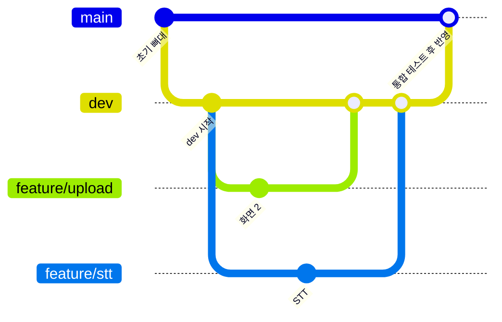
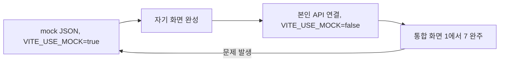

# 07. 개발 규칙 (브랜치·PR·mock)

> 한 줄 요약: `main`·`dev`·`feature/*` 브랜치로 일하고(PR은 `dev`로), `schemas/`·`shared/mock/`은 C 리뷰 후 머지하며, 실제 API가 없을 때는 `VITE_USE_MOCK=true`로 mock JSON을 써서 개발한다.
>
> 기준: Claude Docs 2026-09-29 버전
>
> 관련 문서: [docs/09-git-workflow.md](09-git-workflow.md) (브랜치·PR 절차) · [docs/06-wbs-schedule.md](06-wbs-schedule.md) · [docs/04-api-schema.md](04-api-schema.md) · [docs/05-architecture.md](05-architecture.md) · mock 파일 상세는 [shared/mock/README.md](../shared/mock/README.md)

## 1. 브랜치 전략

브랜치 절차와 명령어는 [09-git-workflow.md](09-git-workflow.md)를 따른다. 여기서는 규칙만 요약한다.

- 브랜치는 `main`(안정 버전), `dev`(통합, 기본 브랜치), `feature/*`(개인 작업) 세 종류다. (확정)
- 예: `feature/upload-screen`, `feature/stt-audio`. 같은 `feature/*` 브랜치를 여러 명이 함께 쓰지 않는다. (확정)
- 버그 수정도 `feature/fix-<내용>` 형식으로 하고, 목요일 14시 이후에는 기능 브랜치를 새로 만들지 않는다. (제안)
- `main`과 `dev`에 직접 push하지 않는다. `feature/*`에서 작업해 PR을 `dev`로 보낸다. (확정)
- `dev → main`은 통합 테스트가 끝난 뒤에만, 한 명이 맡아 PR로 반영한다. (확정)
- 현재 저장소는 무료 플랜이라 브랜치 보호를 쓸 수 없어 팀 약속으로 지킨다. 저장소 위치는 `skkuls-ai/interview_simulation_agent`로 정해졌다.
- 브랜치는 하루 안에 머지될 크기로 짧게 유지한다. (제안)



## 2. 커밋 메시지 (제안)

`<종류>: <한 줄 요약>` 형식, 한국어로 쓴다. 종류는 `feat` `fix` `refactor` `docs` `chore` `test`.

```
feat: 서류 업로드 화면에 동의 체크와 4칸 입력 추가
fix: 1분 30초 초과 시 다음 질문으로 넘어가지 않는 문제 수정
```

- 한 커밋은 한 가지 일만 한다.
- 필드명·API를 바꾸면 커밋 메시지에 `schemas` 변경임을 적는다.

## 3. PR·리뷰 규칙

| 대상 | 리뷰어 | 머지 조건 |
|---|---|---|
| 일반 코드 (자기 폴더) | 다른 1명 (제안) | 실행 확인, 충돌 없음 |
| `backend/app/schemas/` | 통합 책임자 C (확정) | Docs와 필드 일치, 영향받는 담당 확인 |
| `shared/mock/` | 통합 책임자 C (확정) | 실제 API 응답과 같은 모양 |
| 다른 사람 폴더 수정 | 그 폴더 소유자 | 사전에 채널에서 합의 |

- PR 본문에 작업 ID(W-xx), 확인 방법 한 줄을 적는다. (제안)
- 필드명을 바꾸려면 팀 채널에 먼저 올리고, Docs(개발 계약)를 고친 뒤 코드를 고친다. (확정)
- 리뷰는 반나절을 넘기지 않는다. 막히면 채널에서 호출한다. (제안)

## 4. 머지 시점 (제안)

아래 "머지"는 `feature/* → dev` PR을 뜻한다. `main` 반영은 마지막 행에서만 한다.

| 시점 | 규칙 |
|---|---|
| 화 밤 | `schemas/`, mock 6개, 폴더 뼈대를 `dev`에 머지 |
| 수 오전·오후 | 완성된 작업은 바로 `dev`에 머지, 반쪽 기능은 머지하지 않는다 |
| 수 저녁 | 통합 완주(W-22) 확인은 C가 맡고, 이후 `dev`는 항상 실행 가능해야 한다 |
| 목 14시 이후 | 버그 수정·문구·영상 관련 PR만 `dev`에 머지 |
| 발표 전 | 통합 테스트가 끝난 `dev`를 PR로 `main`에 반영 (담당 한 명) |

## 5. 충돌 방지: 폴더별 소유권

Docs 폴더 구조 기준. 소유자가 아닌 사람은 읽기만 하고, 고쳐야 하면 소유자에게 요청한다.

| 경로 | 소유 |
|---|---|
| `backend/app/api/`, `graph/`, `audio/`, `schemas/` | C |
| `backend/app/nodes/prep/` | A(분석), B(질문 생성) |
| `backend/app/nodes/evaluate/` | E |
| `backend/app/banks/` | B |
| `backend/app/validators/` | B (질문 검증, 인용 검증). E는 인용 검증 함수를 호출만 하고 수정은 B에게 요청 |
| `frontend/src/pages/` | 화면 담당: Start·Upload A, Analyzing B, Lobby·Interview D, Evaluating B, Report E |
| `frontend/src/components/` | progress B, interview D, report E, upload A |
| `frontend/src/api/` | D |
| `shared/mock/` | 파일별 작성자 (sample_inputs A, session_preparing A, session_ready B, answer_accepted C, session_evaluating C, report E), 변경은 C 리뷰 |
| `Dockerfile`, `docker-compose.yml`, `.dockerignore` | C |
| `docs/` | 팀 공동, 수정 시 PR |

`nodes/prep/`처럼 두 명이 함께 쓰는 폴더는 파일 단위로 나눠 같은 파일을 동시에 고치지 않는다. (제안)

## 6. 환경변수·API 키

- API 키는 `.env`에만 둔다. `.env`는 커밋하지 않는다. (확정)
- `.env.example`에는 키 이름만 적고 값은 비운다. (확정)
- `.gitignore`에 `.env*`가 등록돼 있는지 저장소 생성 직후 확인한다. `.env.example`만 예외로 추적한다. (제안)
- 키·토큰을 채팅, 코드, 로그, 스크린샷에 붙이지 않는다. 실수로 커밋했다면 키를 폐기·재발급한다. (제안)
- LLM·STT 제공사와 키 이름은 킥오프 결정 후 `.env.example`에 추가한다. (미정)
- 프런트 환경변수는 `VITE_` 접두사만 쓰고, 여기에 비밀 키를 넣지 않는다. (React+Vite 가정, 미정)
- Docker: `.env`와 키 파일을 이미지에 넣지 않는다. `docker-compose.yml`의 `env_file`이나 런타임 환경변수로 주입한다. (제안)
- `.dockerignore`에 `.env*`, 키 파일, `.git`, `node_modules`를 넣는다. 서비스 계정 키 같은 파일은 `.gitignore`에도 추가한다. (제안)

`.env.example` 예시 (키 이름은 예시이며 제공사 확정 후 조정):

```
VITE_USE_MOCK=true
# LLM_API_KEY=
# STT_API_KEY=
```

## 7. 프런트 mock 전환과 개발 순서

- 실제 API가 준비되기 전에는 `shared/mock/`의 JSON으로 개발한다. 프런트는 `VITE_USE_MOCK=true` 하나로 전환한다. (확정)
- 전환 코드는 `frontend/src/api/client.ts`(D)에만 둔다. 화면 코드에서 mock 여부를 직접 분기하지 않는다. (제안)
- Docker에서는 `VITE_USE_MOCK`이 빌드 시점에 고정된다. 값을 바꾸면 `docker compose build frontend`로 프런트 이미지를 다시 빌드해야 한다. 화면을 빠르게 고치는 동안은 로컬 Vite 개발 서버로 mock을 쓰고, 통합 확인은 Docker로 한다. (제안)
- mock은 실제 API와 같은 모양이어야 하고, 고정 데모 시나리오 하나(「RAG 검색 정확도를 20% 개선」이 Q-1·Q-4 답변과 연결)로 맞춘다.
- 백엔드 단위 테스트도 같은 mock을 쓴다.

개발 순서:

1. 화요일: mock으로 화면 완성 (`VITE_USE_MOCK=true`)
2. 수요일 오전: 본인 API가 준비되면 `VITE_USE_MOCK=false`로 바꿔 자기 화면만 실제 연결
3. 수요일 저녁: 전체를 실제 API로 돌려 화면 1→7 완주
4. 문제 시 mock으로 되돌려 화면 문제와 API 문제를 분리해서 본다



## 8. 기타 규칙

- 세션은 메모리에 두며 서버 재시작 시 사라져도 된다. (확정)
- 음성 파일은 STT 후 삭제하고 영상은 서버로 보내지 않는다. 이를 깨는 코드는 머지하지 않는다. (확정)
- 질문의 기대 요소·평가 기준을 API 응답에 넣지 않는다. (확정)
- 코드로 계산할 수 있는 값(답변 시간, 분당 단어 수, 군말 횟수, 인용 위치, 판정 집계)은 LLM에 시키지 않는다. (확정)
