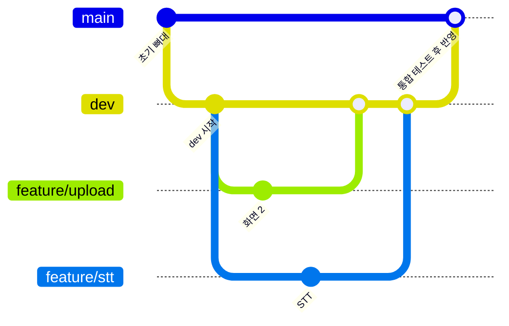

# 09. Git 협업 방식 (main / dev / feature)

> 한 줄 요약: `main`과 `dev`에는 직접 push하지 않고, 최신 `dev`에서 `feature/*` 브랜치를 만들어 작업한 뒤 Pull Request를 `dev`로 보낸다.
>
> 관련 문서: [docs/07-dev-rules.md](07-dev-rules.md) (커밋 규칙·리뷰 대상·폴더 소유권·mock 전환)

저장소:

```text
https://github.com/skkuls-ai/interview_simulation_agent
```

## 1. 브랜치 역할

```text
main        발표·배포 가능한 안정 버전
dev         팀원 작업을 합치는 통합 브랜치 (기본 브랜치)
feature/*   각자 기능을 개발하는 브랜치
```

`main`과 `dev`에는 직접 push하지 않습니다. 각자 `feature/*` 브랜치에서 작업하고 Pull Request를 `dev`로 보냅니다.



## 2. 최초 설정

```bash
git clone https://github.com/skkuls-ai/interview_simulation_agent.git
cd interview_simulation_agent

git switch dev
git pull origin dev
```

## 3. 개인 작업 브랜치 생성

반드시 최신 `dev`에서 생성합니다.

```bash
git switch dev
git pull origin dev
git switch -c feature/기능명
```

브랜치 예시:

```text
feature/perception
feature/document-analysis
feature/question-generator
feature/interview-graph
feature/evaluation-agent
feature/frontend
```

같은 브랜치를 여러 명이 같이 사용하지 않습니다.

## 4. 작업 내용 올리기

```bash
git status
git add .
git commit -m "feat: 구현한 기능 설명"
git push -u origin feature/기능명
```

커밋 메시지 예시:

```text
feat: 질문 생성 agent 구현
fix: 답변 평가 오류 수정
docs: API 연동 문서 추가
test: 질문 생성 테스트 추가
chore: 프로젝트 설정 변경
```

`git add .` 전에 `git status`로 `.env` 같은 파일이 섞이지 않았는지 확인합니다.

## 5. Pull Request 생성

GitHub에서 다음 방향으로 PR을 생성합니다.

```text
base: dev
compare: feature/기능명
```

예시:

```text
feature/question-generator → dev
```

PR에는 다음 내용을 작성합니다.

```md
## 구현 내용

- 질문 생성 Agent 구현
- JD 및 이력서 분석 결과 연결

## 확인 사항

- [ ] 로컬 실행 확인
- [ ] 테스트 통과
- [ ] `.env` 및 API 키가 포함되지 않았는지 확인
```

리뷰와 충돌 해결이 끝난 후 `dev`에 병합합니다. 리뷰어 지정과 머지 조건은 [07-dev-rules.md](07-dev-rules.md)의 PR·리뷰 규칙을 따릅니다.

## 6. 다른 팀원 변경 내용 가져오기

작업 중 최신 `dev` 변경 사항이 필요하면:

```bash
git switch feature/기능명
git fetch origin
git merge origin/dev
```

충돌이 발생하면 충돌 파일을 수정한 후:

```bash
git add .
git commit -m "merge: sync with dev"
git push
```

## 7. main 반영

기능별 PR을 모두 `dev`에 합치고 통합 테스트가 끝난 경우에만 다음 PR을 생성합니다.

```text
dev → main
```

`main` 병합은 한 명이 담당하는 것이 좋습니다.

## 8. 보안 규칙

다음 파일은 절대 GitHub에 올리지 않습니다.

```text
.env
.venv/
node_modules/
dist/
__pycache__/
.pytest_cache/
```

환경변수 이름만 `.env.example`로 공유합니다.

```dotenv
GEMINI_API_KEY=your_api_key_here
```

## 9. 저장소 설정

기본 브랜치를 `dev`로 지정하면 팀원들이 PR을 실수로 `main`에 보내는 일을 줄일 수 있습니다.

```text
GitHub 저장소
→ Settings
→ Branches
→ Default branch
→ dev
```

`main`과 `dev`에 PR 필수 및 force push 차단 규칙을 설정하는 것이 좋습니다. GitHub는 Ruleset으로 PR, 승인, 상태 검사 등을 강제할 수 있습니다. ([GitHub 공식 문서](https://docs.github.com/en/repositories/configuring-branches-and-merges-in-your-repository/managing-rulesets/creating-rulesets-for-a-repository))

> 현재 저장소는 무료 플랜이라 Ruleset·브랜치 보호를 쓸 수 없다. public 전환이나 플랜 업그레이드 전까지는 팀 약속으로 지킨다.
