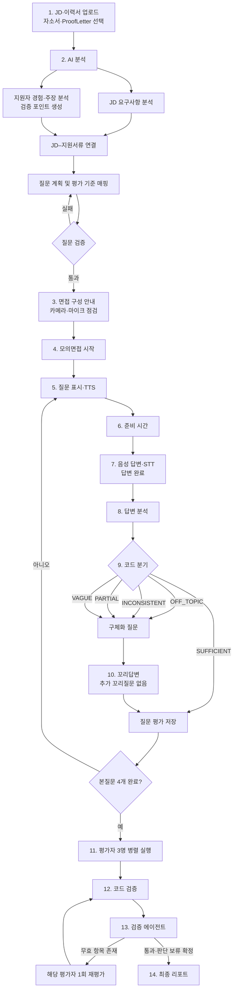
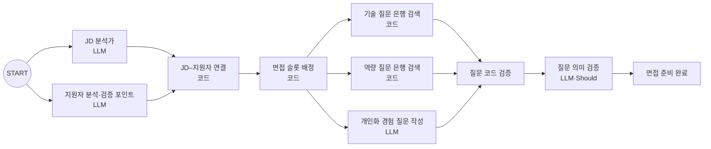
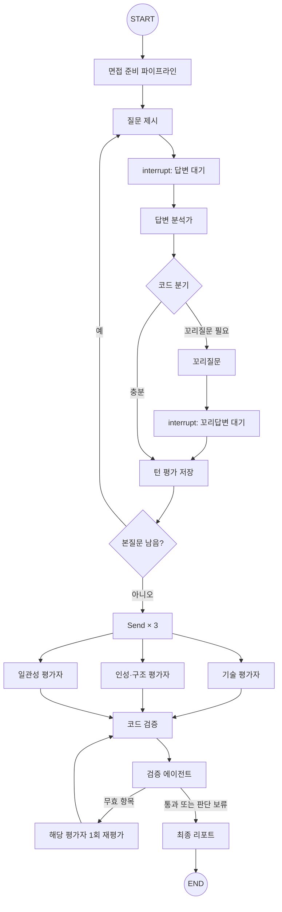
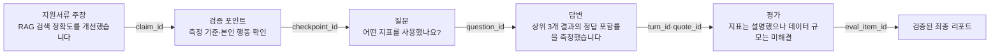
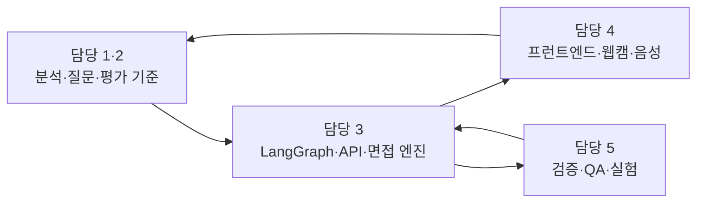

# ProofInterview 프로젝트 기획서

> **참고:** 이 문서는 킥오프 전 초기 기획(범위가 가장 넓은 버전)이다. 구현 범위와 최신 결정은 [01-PRD.md](01-PRD.md)와 [README.md](README.md)를 따른다. 꼬리질문, 평가자 병렬 실행, 검증 에이전트, 검증 실험은 1차 구현 범위에 없다.

> **문서 상태:** 팀 검토용 초안
> 
> 
> **프로젝트 유형:** AI Agent 전문가 양성과정 미니 팀 프로젝트
> 
> **개발 기간:** 2026년 9월 28일 ~ 10월 2일
> 
> **팀 구성:** 5명
> 
> **최종 산출물:** 실행 프로그램, 발표 자료, 구현·시연 영상
> 

---

## 0. 한눈에 보기

### 프로젝트 한 줄 소개

> 채용공고와 지원서류에서 검증이 필요한 내용을 찾아 개인화된 면접을 진행하고, 답변에 따라 꼬리질문을 생성하며, 모든 평가를 실제 답변 인용과 함께 제공하는 AI 면접 코치
> 

### 핵심 메시지

> **내 지원서류를 파고드는 면접관, 근거로 설명하는 평가**
> 

### 핵심 사용자

> 이력서와 자기소개서는 준비했지만 자신의 프로젝트와 기술을 면접에서 구체적으로 설명하는 데 어려움을 겪는 **신입 AI Agent·LLM 애플리케이션 엔지니어 지원자**
> 

### 핵심 기능

1. JD·이력서·자소서 분석
2. 지원서류 검증 포인트 지도 생성
3. 기술·인성 2인 패널 모의면접
4. 답변에 따른 적응형 꼬리질문
5. 웹캠·마이크·TTS·STT 기반 면접 환경
6. 기술·인성·일관성 평가자 병렬 실행
7. 답변 인용 코드 검증과 독립 검증 에이전트
8. 주장 → 질문 → 답변 → 평가 연결 시각화

---

## 1. 프로젝트 배경

취업 준비생은 예상 질문 목록을 구할 수 있지만, 실제 면접에서 발생하는 다음 상황은 혼자 연습하기 어렵다.

- 자신의 이력서와 자기소개서에서 출발하는 개인화 질문
- 모호한 답변에 이어지는 구체화 질문
- 지원서류와 답변이 다를 때 발생하는 검증 질문
- “그래서 본인이 직접 한 일은 무엇인가요?”와 같은 꼬리질문
- 답변의 어느 부분이 왜 부족했는지 보여주는 객관적 피드백

범용 LLM을 이용한 기존 면접 연습에는 다음과 같은 한계가 있다.

| 문제 | 현재 방식의 한계 |
| --- | --- |
| 개인화 부족 | 지원자의 실제 프로젝트와 역할을 반영하지 않은 일반 질문이 많다. |
| 꼬리질문 연습 부족 | 답변이 모호하거나 불완전해도 다음 질문으로 넘어간다. |
| 지원서류와 면접의 단절 | 이력서·자소서의 주장과 실제 답변이 일치하는지 확인하기 어렵다. |
| 평가 근거 부족 | 점수는 제공하지만 어느 답변 때문에 그런 평가가 나왔는지 불명확하다. |
| AI 평가의 환각 | AI가 답변에 없는 문장을 인용하거나 과도하게 해석할 수 있다. |
| 실전 몰입 부족 | 텍스트 입력만으로는 실제 면접과 같은 전달 연습이 어렵다. |

---

## 2. 해결하려는 핵심 문제

> 지원자는 예상 질문은 준비하지만 자신의 지원서류를 파고드는 꼬리질문에서 어려움을 겪는다. 그러나 이를 혼자 반복 연습하고 근거 중심으로 평가받을 방법이 부족하다.
> 

ProofInterview는 단순히 질문을 생성하는 챗봇이 아니라 다음 세 가지를 해결한다.

```
지원서류에서 무엇을 확인해야 하는가?
              ↓
현재 답변을 듣고 다음에 무엇을 물어야 하는가?
              ↓
평가가 실제 답변과 기준에 근거했는가?
```

---

## 3. 프로젝트 목표와 비목표

### 3.1 목표

- JD와 지원서류를 분석해 개인화된 검증 포인트를 만든다.
- 답변의 충분성·누락·모호함·모순·질문 이탈을 구분한다.
- 코드 정책에 따라 다음 질문을 결정한다.
- 실제 답변 인용을 포함한 평가를 제공한다.
- AI가 만든 평가도 별도의 검증 관문을 통과하게 한다.
- 웹캠과 음성을 활용해 실제 면접에 가까운 경험을 제공한다.
- 전체 과정을 재현 가능한 고정 데모와 정량 실험으로 검증한다.

### 3.2 비목표

- 실제 채용 합격 여부 예측
- 외모·표정으로 성격이나 역량 판단
- 감정·자신감·진실성 추론
- 정밀한 화면 좌표 단위 시선 추적
- 카메라 지표를 채용 점수에 반영
- 모든 IT 직무 지원
- 실시간 양방향 음성 대화

---

## 4. 목표 사용자와 직무 범위

### 목표 사용자

> 신입 AI Agent·LLM 애플리케이션 엔지니어 지원자
> 

### 직무를 하나로 제한하는 이유

- 팀이 기술 질문과 평가 기준을 직접 검수할 수 있다.
- LangChain, LangGraph, RAG, FastAPI 등 교육 내용과 밀접하다.
- 기존 Project04~Project06을 테스트용 경험 데이터로 활용할 수 있다.
- 짧은 기간에도 신뢰 가능한 질문 은행을 구성할 수 있다.
- 직무별로 달라지는 평가 기준의 범위를 통제할 수 있다.

---

## 5. 핵심 차별점

### D1. 지원서류 기반 검증 포인트 지도

지원서류의 문장을 다음 유형으로 구조화한다.

- 수치와 성과
- 본인이 맡은 역할
- 사용한 기술
- 문제 해결 과정
- 의사결정 근거
- 협업 방식
- 성과 측정 기준

시스템은 이를 거짓이나 약점으로 단정하지 않고, **면접에서 추가 확인이 필요한 검증 포인트**로 정의한다.

### D2. 답변에 따라 달라지는 면접 흐름

답변 분석 LLM은 관찰 결과를 구조화하고, 코드가 명시적인 정책에 따라 다음 행동을 결정한다.

```
LLM: 답변 관찰
     - 질문에 답했는가?
     - 필수 요소가 빠졌는가?
     - 수치·역할·행동이 모호한가?
     - 지원서류와 모순되는가?

코드: 라우팅 정책 집행
     - OFF_TOPIC
     - INCONSISTENT
     - PARTIAL
     - VAGUE
     - SUFFICIENT
```

### D3. 답변 인용 기반 평가

모든 주요 평가에는 실제 답변에서 가져온 인용문을 포함한다.

```
평가 항목
→ 실제 답변 인용
→ 적용한 평가 기준
→ 잘한 점
→ 미해결 요소
→ 개선 방향
```

인용문이 실제 답변에 존재하는지는 코드가 검사한다.

### D4. AI 평가를 감사하는 검증 에이전트

검증 에이전트는 지원자를 채점하는 네 번째 평가자가 아니다. 질문과 평가가 실제 근거를 지켰는지 검사하는 독립적인 품질 관문이다.

- 질문이 JD·지원서류·검증 포인트와 연결되는가?
- 평가 인용이 실제 답변에 존재하는가?
- 모순 판정이 실제 두 인용에 근거하는가?
- 기술 평가가 사람이 검수한 기준을 사용했는가?
- 평가자가 답변에 없는 내용을 만들지 않았는가?
- 평가자 결과가 서로 충돌하지 않는가?
- 개선 예시가 새로운 경험을 지어내지 않았는가?

### D5. 실제 면접에 가까운 멀티모달 경험

- 웹캠 기반 면접 화면
- 마이크를 이용한 답변
- STT 음성 인식
- TTS 질문 음성 재생
- 준비 시간과 답변 제한시간
- 얼굴 존재·정면 유지·표정 변화 참고 지표

카메라 지표는 종합 평가 점수에서 제외하고 전달 습관을 돌아보기 위한 참고 정보로만 제공한다.

---

## 6. 입력 모드

### 6.1 기본 모드

필수 입력:

- 채용공고(JD)
- 이력서

선택 입력:

- 자기소개서

지원 방식:

| 문서 | 필수 여부 | 지원 형식 | 대체 입력 |
| --- | --- | --- | --- |
| 채용공고(JD) | 필수 | PDF·DOCX·TXT | 텍스트 직접 입력 |
| 이력서 | 필수 | PDF·DOCX·TXT | 텍스트 직접 입력 |
| 자기소개서 | 선택 | PDF·DOCX·TXT | 텍스트 직접 입력 |

업로드한 문서는 서버에서 텍스트만 추출해 분석에 사용한다. 파일에서 충분한 텍스트를 추출하지 못하면 사용자에게 직접 입력을 안내한다. HWP와 이미지로만 구성된 스캔 PDF의 OCR은 MVP 범위에서 제외한다.

기능:

- JD 요구사항 분석
- 지원서류 주장 추출
- 검증 포인트 탐지
- 지원서류와 면접 답변의 일관성 검사
- 개인화 질문과 꼬리질문 생성

> 기본 모드에서는 지원서류에 적힌 주장이 실제 사실인지 단정하지 않는다. 확인이 필요한 주장과 지원서류–답변 간 일관성만 판단한다.
> 

---

## 7. 전체 사용자 흐름



### 면접 중 피드백 원칙

면접 중에는 상세 점수와 개선점을 보여주지 않는다. 즉시 피드백은 다음 답변에 영향을 주어 실전 시뮬레이션을 왜곡할 수 있기 때문이다.

면접 중 사용자에게는 다음 정도만 표시한다.

```
답변이 기록되었습니다.
다음 질문을 준비하고 있습니다.
```

상세 피드백은 면접 종료 후 공개한다.

---

## 8. 준비 단계 설계

### 8.1 준비 파이프라인



### 8.2 구성요소별 책임

| 구성요소 | 방식 | 역할 |
| --- | --- | --- |
| JD 분석가 | LLM | 필수·우대 기술, 주요 업무, 핵심 역량 추출 |
| 지원자 분석·검증 포인트 | LLM | 이력서·자소서 주장과 확인할 항목 추출 |
| JD–지원자 연결 | 코드 | 정규화한 기술명과 ID 연결, 누락·금지 항목 정리 |
| 면접 슬롯 배정 | 코드 | 기술·인성 질문 수, 순서, 면접관 배정 |
| 기술 질문 검색 | 코드 | 직무 기술·난이도 메타데이터와 유사도를 이용해 기술 질문 선택 |
| 역량 질문 검색 | 코드 | JD 핵심 역량과 지원자 경험에 맞는 구조화 행동 질문 선택 |
| 개인화 경험 질문 작성 | LLM | 지원서류의 검증 포인트와 기대 요소에 맞는 질문 생성 |
| 질문 코드 검증 | 코드·Must | ID·출처·기대 요소·중복·질문 수 검사 |
| 질문 의미 검증 | LLM·Should | 직무 관련성, 유도 질문, 근거 없는 전제 검사 |

### 8.3 평가 기준 출처

| 질문 유형 | 평가 기준 출처 |
| --- | --- |
| 기술 질문 | 사람이 검수한 질문 은행의 필수 포인트·오개념 |
| 인성 질문 | 사전에 정의한 고정 평가 기준표 |
| 개인화 경험 질문 | 검증 포인트와 해당 질문의 기대 요소 |
| 꼬리질문 | 해결하려는 누락·모순·모호함 신호 |

> LLM이 임의로 채점 기준을 만들고 그 기준으로 다시 채점하는 순환을 피한다.
> 

---

## 9. 면접 구성

### 9.1 면접 형태

- 2:1 패널 면접 UI
- 기술 면접관 1명
- 인성 면접관 1명
- 내부적으로 역할별 프롬프트 사용
- 면접관 교대는 코드 규칙으로 처리
- 두 면접관이 자율적으로 대화하거나 협상하지 않음

### 9.2 데모 모드 질문 구성

| 순서 | 면접관 | 질문 종류 | 출처 |
| --- | --- | --- | --- |
| 1 | 기술 | 프로젝트 경험 검증 | 지원서류 검증 포인트 |
| 2 | 기술 | 기술 지식·설계 선택 | 기술 질문 은행 |
| 3 | 인성 | 협업·문제 해결 경험 | 지원서류 + 인성 기준표 |
| 4 | 인성 | 지원 동기·직무 연결·회고 | JD–지원자 연결 결과 |

### 9.3 꼬리질문 제한

```
본질문당 최대 꼬리질문: 1개
전체 면접 최대 꼬리질문: 2개
질문 재진술도 꼬리질문 횟수에 포함
꼬리답변 이후 추가 꼬리질문 없음
```

### 9.4 시간 설정

| 모드 | 준비 시간 | 답변 시간 | 본질문 | 꼬리질문 |
| --- | --- | --- | --- | --- |
| 데모 모드 | 5초 | 최대 30초 | 4개 | 전체 최대 2개 |
| 일반 모드·Should | 10초 | 최대 60~90초 | 4~6개 | 질문당 최대 1개 |

데모 모드는 발표 영상과 시연 시간을 위한 단축 모드다.

---

## 10. 답변 분석과 코드 분기

### 10.1 답변 분석가 출력

답변 분석가는 분기 라벨을 직접 선택하지 않고 관찰값을 구조화한다.

```json
{
  "on_topic": true,
  "missing_elements": [
    {
      "element_id": "E-002",
      "description": "검색 품질 측정 방식",
      "importance": "required"
    }
  ],
  "specificity_gaps": [
    {
      "target": "본인이 직접 수행한 행동",
      "severity": "high"
    }
  ],
  "contradictions": [],
  "new_claims": [],
  "quotes": [],
  "followups": {
    "off_topic": null,
    "inconsistent": null,
    "partial": "검색 품질을 어떤 기준으로 측정했나요?",
    "vague": "그 과정에서 본인이 직접 수행한 작업은 무엇인가요?"
  }
}
```

### 10.2 코드 분기 정책

```python
if not on_topic:
    decision = "OFF_TOPIC"
elif verified_contradictions:
    decision = "INCONSISTENT"
elif required_missing_elements:
    decision = "PARTIAL"
elif high_severity_specificity_gaps:
    decision = "VAGUE"
else:
    decision = "SUFFICIENT"
```

### 10.3 분기 정의

| 분기 | 조건 | 다음 행동 |
| --- | --- | --- |
| OFF_TOPIC | 질문에 답하지 않음 | 원래 질문을 짧게 재진술 |
| INCONSISTENT | 지원서류와 답변의 검증된 인용이 충돌 | 차이를 설명하도록 검증 질문 |
| PARTIAL | 질문의 필수 요소 누락 | 빠진 요소를 묻는 보충 질문 |
| VAGUE | 요소는 언급했으나 수치·역할·행동이 모호 | 구체화 질문 |
| SUFFICIENT | 필수 요소를 구체적으로 설명 | 다음 본질문 |

### 10.4 새로운 주장 처리

```
새로운 주장 발견
→ new_claims에 저장
→ 검증 포인트 지도에 추가
→ 기존 기록과 직접 충돌하면 INCONSISTENT 후보
→ 충돌하지 않으면 미확인 주장으로 기록
→ 새로운 주장이라는 이유만으로 감점하거나 거짓으로 판정하지 않음
```

새로운 주장이 모호하면 VAGUE, 질문의 필수 요소를 충족하지 못하면 PARTIAL이 될 수 있지만, 단순히 지원서류에 없다는 이유만으로 INCONSISTENT가 되지는 않는다.

---

## 11. 질문 은행

### 11.1 두 질문 은행의 역할 분리

ProofInterview는 질문의 목적과 평가 근거가 다른 두 은행을 분리해 운영한다.

| 구분 | 기술 질문 은행 | 역량·인성 질문 은행 |
| --- | --- | --- |
| 목적 | AI Agent·LLM 애플리케이션 직무의 기술 지식과 설계 판단 평가 | 실제 경험을 통해 행동 역량과 업무 방식을 확인 |
| 주요 내용 | 개념, 설계 선택, 트레이드오프, 장애 대응, 오개념 | 성과, 관계, 적응, 리더십 기반 구조화 행동·상황 질문 |
| 평가 기준 | 필수 포인트, 선택 포인트, 대표 오개념 | 질문 의도, 긍정 신호, 위험 신호, STAR·구체성 기준 |
| 선택 방식 | JD 기술·난이도·주제 기반 검색 | JD 핵심 역량·지원자 경험·면접 슬롯 기반 검색 |
| 개인화 | 공통 질문 뒤 경험 기반 꼬리질문으로 연결 | 원문을 그대로 출제하지 않고 지원자 경험과 JD에 맞게 재구성 |

> 질문 은행은 공통 평가 기준을 제공하고, 지원자별 경험 주장의 검증은 별도의 검증 포인트가 담당한다.
> 

### 11.2 제공 자료 분석 결과

담당 2가 제공한 다음 자료를 역량·인성 질문 은행의 참고 원천으로 사용한다.

- `역량기반_구조화_면접_질문_150선.xlsx`
- `채용_구조화 면접 질문 150선.pdf`

엑셀 자료의 구조는 다음과 같다.

| 항목 | 분석 결과 |
| --- | --- |
| 전체 문항 | 150개 |
| 대분류 | 성과 60 / 관계 35 / 적응 25 / 리더십 30 |
| 세부 역량 | 30개, 역량별 5문항 |
| 질문 유형 | 경험 질문 96 / 상황 질문 54 |
| 주요 필드 | 대분류, 소분류, 설명, 질문 유형, 질문, 추가 질문, 질문 의도, Positive, Negative |
| 정확히 중복된 질문 문구 | 4개 그룹 |
| 고유 질문 문구 | 146개 |

이 자료의 장점은 질문뿐 아니라 질문 의도, 추가 질문, 긍정·위험 신호가 함께 있다는 점이다. 다만 해당 신호를 자동 점수로 직접 변환하지 않고 평가자가 확인할 **참고 신호**로 사용한다.

신입 AI Agent·LLM 애플리케이션 엔지니어에게 우선 적용할 역량은 다음과 같다.

- 문제 해결
- 계획 수립
- 정보 관리
- 업무 지식·기술
- 실행력
- 의사소통
- 협업
- 유연성
- 책임감
- 성취 지향·열정

### 11.3 기술 질문 데이터 예시

```json
{
  "question_id": "TECH-RAG-001",
  "bank_type": "technical",
  "topic": "RAG",
  "difficulty": "basic",
  "question": "RAG에서 chunk size가 검색 품질에 미치는 영향을 설명해 주세요.",
  "required_points": [
    "검색 단위의 구체성",
    "문맥 보존",
    "토큰 비용 또는 컨텍스트 한도"
  ],
  "optional_points": [
    "chunk overlap",
    "데이터 특성에 따른 실험 필요성"
  ],
  "misconceptions": [
    "chunk가 작을수록 항상 좋다고 단정"
  ],
  "followup_templates": [
    "직접 사용한 chunk size와 선정 근거는 무엇인가요?"
  ],
  "source": "수업 자료 또는 공식 문서",
  "human_reviewed": true
}
```

### 11.4 역량·인성 질문 데이터 예시

```json
{
  "question_id": "COMP-PROBLEM-001",
  "bank_type": "competency",
  "category": "성과",
  "competency": "문제 해결",
  "question_type": "experience",
  "question": "프로젝트에서 예상하지 못한 문제를 발견하고 해결한 경험을 설명해 주세요.",
  "intent": "문제 정의, 원인 분석, 실행과 결과를 확인",
  "followup_templates": [
    "원인을 어떤 근거로 판단했나요?",
    "그 과정에서 본인이 직접 맡은 일은 무엇이었나요?"
  ],
  "positive_signals": [
    "구체적인 상황과 본인 행동을 구분해 설명",
    "판단 근거와 결과 측정 방법을 제시"
  ],
  "risk_signals": [
    "팀의 성과만 말하고 본인 행동이 불명확",
    "결과를 주장하지만 확인 가능한 근거가 없음"
  ],
  "source": "구조화 면접 질문 자료를 프로젝트 목적에 맞게 재구성",
  "human_reviewed": true
}
```

### 11.5 선정·재구성 원칙

1. JD에서 요구하는 핵심 역량과 연결되는 질문을 우선한다.
2. 같은 의도를 가진 중복 문항은 하나로 통합한다.
3. 지원자의 이력서·자소서 경험에 맞게 표현을 재구성한다.
4. Positive·Negative 항목은 맥락에 따라 달라질 수 있으므로 자동 감점·가점 규칙으로 사용하지 않는다.
5. 기술 질문의 필수 포인트와 오개념은 팀원이 직접 검수한다.
6. 질문마다 출처, 평가 기준, 검수 여부를 저장한다.
7. 질문 은행이 답을 미리 알려주지 않도록 평가 요소는 면접 화면에 노출하지 않는다.

### 11.6 범위

| 범위 | 기술 질문 | 역량·인성 질문 |
| --- | --- | --- |
| Must | 데모용 10개, 사람 검수 | 우선 역량 중심 10개, 사람 검수 |
| 목표 | 30개 내외 | 30개 내외 |

기술 질문의 우선 주제:

- LLM·프롬프트
- RAG·Embedding·Vector DB
- LangChain·LangGraph
- AI Agent·멀티 에이전트
- 데이터 처리·검증
- FastAPI·서비스 설계

### 11.7 저작권과 활용 범위

제공된 PDF에는 JOBDA·자인원 및 2022년 저작권 표기가 있다. 따라서 원문 150개 전체를 공개 저장소나 서비스에 그대로 재배포하지 않는다.

- 팀 내부 분석·학습 자료로 활용한다.
- MVP에는 필요한 문항만 선별하고 프로젝트 목적에 맞게 재구성한다.
- 발표 자료에는 출처를 표시한다.
- 공개 저장소에는 원본 PDF·엑셀 전체와 대량의 원문 질문을 올리지 않는다.

---

## 12. 에이전트·노드 구조



### 구성요소별 역할

| 단계 | 구성요소 | 역할 |
| --- | --- | --- |
| 준비 | JD 분석가 | 직무 요구사항 구조화 |
| 준비 | 지원자 분석가 | 경험·주장·검증 포인트 추출 |
| 준비 | 질문 계획 | 면접 슬롯과 평가 기준 연결 |
| 진행 | 답변 대기 노드 | `interrupt()`로 사용자 입력 대기 |
| 진행 | 답변 분석가 | 관찰값·인용·꼬리질문 후보 생성 |
| 진행 | 코드 라우터 | 우선순위와 횟수 제한 집행 |
| 평가 | 기술 평가자 | 기술 정확성·깊이·오개념 평가 |
| 평가 | 인성·구조 평가자 | STAR·본인 역할·구체성 평가 |
| 평가 | 일관성 평가자 | 지원서류·경험·답변 간 일관성 평가 |
| 검증 | 코드 검증기 | ID·인용·점수·횟수·필드 검사 |
| 검증 | 검증 에이전트 | 의미적 근거와 평가자 충돌 감사 |
| 결과 | 리포트 작성자 | 검증된 항목만 사용해 최종 리포트 생성 |

---

## 13. 검증 관문

### 13.1 질문 검증

코드 검증·Must:

- 모든 질문에 `question_id`가 있는가?
- 개인화 질문에 `checkpoint_id`가 연결되어 있는가?
- 기술 질문에 `question_bank_id`가 연결되어 있는가?
- 인성 질문에 고정 평가 기준이 연결되어 있는가?
- 질문에 기대 요소가 있는가?
- 중복 질문이 없는가?
- 질문 수와 면접관 배정이 규칙을 지키는가?

의미 검증·Should:

- 실제 검증 포인트를 확인하는 질문인가?
- 지원 직무와 관련 있는가?
- 답을 미리 알려주는 유도 질문이 아닌가?
- 지원서류에 없는 사실을 전제하지 않는가?

### 13.2 평가 코드 검증

- `eval_item_id`, `question_id`, `turn_id`가 실제로 존재하는가?
- 인용문이 실제 원문에 존재하는가?
- 기술 평가가 질문 은행 기준을 참조하는가?
- 점수와 항목별 판정 계산이 코드 규칙과 일치하는가?
- 꼬리질문 횟수가 상한을 넘지 않았는가?
- 필수 출력 필드가 모두 존재하는가?

### 13.3 평가 의미 검증

- 인용이 평가 결론을 실제로 뒷받침하는가?
- 모순 판정이 과도한 해석이 아닌가?
- 평가자들이 같은 답변에 대해 충돌하지 않는가?
- 답변에 없는 기술이나 경험을 만들어내지 않았는가?
- 개선 예시가 지원자의 경험 범위를 벗어나지 않는가?

### 13.4 실패 처리

```
평가자 3명 병렬 실행
→ 코드 검증
→ 검증 에이전트
→ 무효 eval_item_id 추출
→ 해당 항목을 만든 평가자만 1회 재평가
→ 다시 코드 검증
→ 계속 실패하면 해당 항목 판단 보류
→ 검증 통과 항목만 리포트에 사용
```

평가자 간 충돌에서 어느 쪽이 틀렸는지 근거로 결정할 수 없다면 리포트 작성자가 임의로 선택하지 않고 `판단 보류`로 남긴다.

---

## 14. 추적 ID와 연결 구조

### 14.1 ID 체계

```
session_id
claim_id
checkpoint_id
question_id
turn_id
quote_id
eval_item_id
```

### 14.2 연결 예시



### 14.3 인용 검증

1. 공백과 줄바꿈을 정규화한다.
2. 인용문이 원문에 실제 포함되는지 확인한다.
3. 포함되면 위치를 코드가 다시 계산한다.
4. 없으면 인용을 무효 처리한다.
5. 무효 인용에 의존한 모순·평가도 함께 무효 처리한다.

LLM이 반환한 문자열 위치는 신뢰하지 않고 코드가 원문에서 다시 찾는다.

---

## 15. 음성·웹캠·표정·시선 기능

### 15.1 음성 기능

Must:

- 브라우저 TTS로 질문 재생
- STT로 음성 답변 인식
- STT 원문 자동 저장·제출
- 답변 완료 버튼
- STT 미지원·실패 시 텍스트 입력 fallback
- 분석 프롬프트에 음성 인식 오류 가능성 명시

Could:

- 음성 인식 오류 교정
- STT 원문과 교정본 분리
- `correction_ratio`
- 교정본 기반 의미 평가
- 별도 음성 모델을 이용한 상세 전사

### 15.2 웹캠·표정·시선 참고 지표

Must:

- 카메라 권한 요청과 오류 처리
- 웹캠 미리보기
- 얼굴 존재 비율
- 정면 유지 비율
- 시선·고개 이탈 횟수
- 표정 변화 참고 지표
- 측정 신뢰도와 측정 불가 상태
- 원본 영상 비전송·비저장

### 15.3 사용 원칙

가능:

- 얼굴 감지
- 정면 유지 경향 (시선 위주)
- 표정 변화량
- 측정 가능 여부

금지:

- 불안함·자신감·진실성 판정
- 성격 추론
- 외모 기반 평가
- 합격 가능성 추론
- 카메라 지표의 종합 점수 반영

표정·시선 지표는 **전달 습관 참고 정보**로만 표시한다.

---

## 16. 최종 리포트

### 16.1 메인 판정

총점 하나보다 항목별 판정을 중심으로 제공한다.

| 평가 영역 | 표시 방식 |
| --- | --- |
| 기술 이해 | 충분 / 보완 필요 / 미흡 / 판단 보류 |
| 답변 구조 | 충분 / 보완 필요 / 미흡 / 판단 보류 |
| 지원서류 일관성 | 충분 / 보완 필요 / 미흡 / 판단 보류 |
| 전달 참고 지표 | 측정 결과 또는 측정 불가 |

### 16.2 각 항목에 포함할 내용

- 실제 답변 인용
- 적용한 평가 기준
- 잘한 점
- 보완할 점
- 미해결 검증 포인트
- 다음 연습 행동
- 근거 범위 안에서 작성한 개선 답변 예시

### 16.3 사용하지 않는 표현

- 합격 가능성
- 채용 점수
- 상위 몇 퍼센트
- 성격·감정 단정
- 자신감·진실성 점수

---

## 17. 검증 실험

모든 실험의 정답 라벨과 판정 기준은 결과 확인 전에 팀이 먼저 확정한다. 결과를 보고 기준을 바꾸지 않는다.

### 실험 1. 꼬리질문 적중률

목적:

- 검증 포인트가 실제 본질문과 꼬리질문에 반영되는지 확인
- 단일 프롬프트 방식과 비교

판정:

| 판정 | 기준 |
| --- | --- |
| 적중 | 사전 지정한 검증 포인트를 직접 질문 |
| 부분 적중 | 관련 경험은 물었지만 핵심 포인트를 검증하지 않음 |
| 실패 | 일반 질문 또는 무관한 질문 |

비교 조건:

- 같은 모델
- 같은 입력
- 같은 질문 수
- 같은 테스트 데이터

### 실험 2. 분기 정확도

| 답변 유형 | 기대 처리 |
| --- | --- |
| 충분하고 구체적인 답변 | SUFFICIENT |
| 필수 요소가 빠진 답변 | PARTIAL |
| 요소는 있으나 수치·역할이 모호함 | VAGUE |
| 지원서류와 명확히 모순됨 | INCONSISTENT |
| 질문과 무관함 | OFF_TOPIC |
| 지원서류에 없던 새로운 주장 | 검증 포인트 추가, 다른 신호로 분기 |

목표 가안: 전체 테스트 대본 기준 80% 이상

### 실험 3. 평가 근거 유효성

- 평가 인용이 실제 답변에 존재하는 비율
- 무효 인용을 코드가 제거하는 비율
- 좋은 답변과 나쁜 답변의 판정 분리
- 평가자 간 충돌 탐지
- 평가자 하나가 실패해도 부분 리포트가 생성되는지 확인

### 실험 4. 검증 관문 결함 적발 능력

일부러 결함을 삽입한 평가 세트를 만든다.

결함 유형:

- 답변에 존재하지 않는 인용
- 다른 답변의 인용 사용
- 질문 기준과 무관한 판정
- 존재하지 않는 경험 생성
- 기술 오개념을 정답으로 판정
- 코드 판정과 리포트 표현 불일치
- 존재하지 않는 `checkpoint_id`
- 평가자 간 상충 결과

측정 지표:

```
결함 재현율 = 탐지한 결함 수 / 전체 주입 결함 수
정상 항목 오탐률 = 잘못 거부한 정상 항목 수 / 전체 정상 항목 수
정상 항목 유지율 = 1 - 정상 항목 오탐률
```

---

## 18. 응답 속도 목표

| 구간 | 목표 |
| --- | --- |
| 답변 완료 후 분기 판단 | 5초 이내 |
| 꼬리질문 표시 | 8초 이내 |
| 최종 리포트 | 15~30초 |
| 카메라 참고 지표 | 면접 중 주기적 계산 |

한 턴에는 기본적으로 답변 분석 LLM을 한 번만 호출한다. 꼬리질문 후보도 동일 호출에서 생성하되, 코드가 선택한 분기와 일치하는 후보만 사용한다.

최종 평가자 3명은 면접 종료 후 병렬 실행한다.

---

## 19. 기능 우선순위

### Must

- JD·이력서 업로드
- 자기소개서 선택 입력
- 고정 데모 샘플
- 검증 포인트 지도
- 사람이 검수한 기술 질문 10개
- 제공 자료에서 선별·재구성한 역량·인성 질문 10개
- 고정 인성 평가 기준표
- 질문 코드 검증
- 2인 패널 면접 UI
- 본질문 4개
- 전체 꼬리질문 최대 2개
- 5가지 코드 분기
- LangGraph `interrupt` 기반 답변 대기
- TTS
- STT + 텍스트 fallback
- 답변 완료 버튼
- 웹캠 미리보기
- 얼굴 존재·정면 유지·표정·시선 참고 지표
- 평가자 3명 병렬 실행
- 코드 인용 검증
- 검증 에이전트
- 무효 평가 선택적 1회 재평가
- 평가자 실패 시 부분 리포트
- 항목별 판정 리포트
- 주장 → 질문 → 답변 → 평가 연결 시각화

### Should

- 질문 의미 검증
- 기술 질문 은행 30개
- 역량·인성 질문 은행 30개
- 일반 면접 모드
- ProofLetter JSON 불러오기
- 경험 근거 강화 모드
- 답변 시간·분당 단어 수
- 군말 참고 지표

### Could

- 음성 인식 오류 교정
- STT 원문과 교정본 비교
- 상세 음성 전사
- 침묵 구간 분석
- 장기 메모리
- 별도 자연음성 TTS
- 질문 난이도 자동 조절

### Won’t

- 정밀 화면 좌표 시선 추적
- 감정·자신감·진실성 분석
- 카메라 지표의 채용 점수 반영
- 영상 서버 저장
- 실시간 양방향 음성
- 직무 2개 이상
- 로그인·회원 관리
- 합격 가능성 예측

---

## 20. 팀 역할 분담



### 담당 1: PM·분석 공동 담당

- 전체 일정과 우선순위 관리
- 지원자 분석·검증 포인트 설계
- 면접 질문 계획
- 공통 계약 취합
- PPT 최종 취합
- 고정 데모 시나리오·대본
- Day 3 리포트 연결 시각화 지원

### 담당 2: 분석·평가 기준 담당

- JD 분석
- JD–지원서류 연결
- 기술 질문 은행
- 제공된 구조화 면접 질문 자료 분석·선별
- 역량·인성 질문 은행
- 기술 평가 기준
- 인성 고정 평가 기준표
- 평가자 3명의 프롬프트
- 리포트 작성자 프롬프트

### 담당 1·2 공동 범위

```
지원서류 업로드 정의
→ JD 요구사항 분석
→ 지원자 경험·주장 분석
→ JD–지원서류 연결
→ 검증 포인트 지도
→ 질문 계획
→ 평가 기준·기대 요소 매핑
```

### 담당 3: LangGraph·FastAPI·면접 실행 엔진

- 공통 State와 ID 규칙
- LangGraph 전체 구성
- checkpointer·`thread_id`
- `interrupt()`·`Command(resume=...)`
- FastAPI 면접 세션 API
- 답변 분석가 프롬프트
- 코드 분기
- 꼬리질문 루프
- 평가자 3명 병렬 실행 연결
- 선택적 재평가 연결
- 전체 백엔드 통합

첫 번째 완료 목표:

```
질문 1개
→ interrupt
→ 답변 API 제출
→ 그래프 재개
→ 코드 분기
→ 다음 질문 반환
```

### 담당 4: 전체 프런트엔드·멀티모달

- 지원서류 입력 화면
- 분석 진행 화면
- 검증 포인트 지도
- 장치 점검 화면
- 2인 패널 면접 UI
- 질문·타이머·답변 완료
- TTS·STT·텍스트 fallback
- 웹캠 권한·미리보기
- MediaPipe 연동
- 표정·정면·시선 참고 지표
- 결과 리포트 UI
- API 연동
- 연결 시각화 기본 컴포넌트

담당 4의 구현 우선순위:

```
전체 화면 이동
→ 실제 API 연결
→ TTS
→ STT·텍스트 fallback
→ 웹캠 미리보기
→ 얼굴·정면·시선 참고 지표
→ 표정 참고 지표
→ 디자인·애니메이션
```

### 담당 5: 검증 에이전트·코드 검증·QA·실험

- 질문 ID·출처·평가 기준 연결 검사
- 평가 ID와 인용 원문 검사
- 검증 에이전트
- 평가자 간 충돌 탐지
- 무효 평가 선택적 재실행 조건
- 부분 리포트 검증
- 고정 테스트 답변과 정답 라벨
- 꼬리질문 적중률 실험
- 분기 정확도 실험
- 평가 근거 유효성 실험
- 검증 관문 결함 실험
- 발표용 실험 결과표

### 역할 간 필수 협업

| 협업 조합 | 먼저 합의할 내용 |
| --- | --- |
| 담당 1·2 + 담당 3 | 분석 결과와 InterviewState 스키마 |
| 담당 2 + 담당 3 | 질문 기대 요소와 평가자 입출력 |
| 담당 3 + 담당 4 | 세션 API와 interrupt 응답 형식 |
| 담당 3 + 담당 5 | 평가·검증·재시도 스키마 |
| 담당 4 + 담당 5 | 카메라 참고 지표의 결과 형식과 리포트 표현 |

---

## 21. 공통 개발 계약

### 21.1 ID

```
session_id
claim_id
checkpoint_id
question_id
turn_id
quote_id
eval_item_id
```

### 21.2 API 초안

```
POST /api/interviews
POST /api/interviews/{session_id}/answers
GET  /api/interviews/{session_id}
GET  /api/interviews/{session_id}/report
```

### 21.3 공통 원칙

- API 응답과 State 필드명을 담당자 개인이 임의로 변경하지 않는다.
- 변경이 필요하면 팀에 먼저 공유한다.
- 모든 팀원이 같은 고정 데모 데이터를 사용한다.
- 실제 API 연결 전에는 공통 mock JSON을 사용한다.
- LLM 구조화 출력은 Pydantic 스키마로 고정한다.
- 코드로 확인할 수 있는 값은 LLM에게 계산시키지 않는다.
- 질문의 평가 요소는 사용자 화면에 노출하지 않는다.
- 모든 LLM 출력은 실패 가능성을 전제로 fallback을 둔다.

---

## 22. 개발 일정과 마감

### 9월 28일 저녁: 개발 계약 확정

- State 초안
- ID 규칙
- API 계약
- 공통 mock JSON
- 고정 데모 입력
- 각 담당의 입출력 스키마
- Git 작업 규칙

### 9월 29일: 기술 검증과 핵심 기능

오전:

- `interrupt → resume` spike
- STT·TTS spike
- 카메라·MediaPipe spike
- 질문·평가 스키마 확정
- 코드 분기 단위 테스트

오후:

- 담당별 기능 구현
- mock 데이터 기반 프런트엔드 구현

### 9월 30일: 기능 완성과 1차 통합

- 준비 파이프라인
- 면접 루프
- 꼬리질문
- 평가자 병렬 실행
- 검증 관문
- 프런트엔드 연결

9월 30일 저녁 통합 기준:

> 고정 샘플이 입력부터 리포트까지 최소 한 번 완주해야 한다.
> 

### 10월 1일 오전: QA·실험·영상 준비

- 오류 수정
- 응답 속도 측정
- 검증 실험 1~4
- 장치·API fallback 점검
- 데모 대본 확정
- PPT 초안 통합

### 10월 1일 14시: 기능 추가 중단

14시 이후:

- 신규 기능 추가 금지
- 버그 수정
- UI·문구 정리
- 실험 결과 확정
- 시연 영상 녹화
- 발표 자료 완성

### 10월 2일 오전

- 전체 발표 리허설
- 데모 영상 재생 확인
- 라이브 데모 fallback 확인
- 예상 질문 점검

### 10월 2일 16시

- 최종 발표

---

## 23. 비상시 범위 축소 순서

일정이 밀릴 때 아래 순서대로 축소한다.

1. 질문 은행 30개 → 검수된 10개
2. 표정·정면·시선 지표 → 웹캠 미리보기만 유지
3. 2인 패널 화면 연출 → 면접관 이름표·아이콘만 유지
4. STT → 텍스트 입력만 유지
5. 일반 모드 → 4문항 데모 모드만 유지

### 절대 제외하지 않는 핵심

- 검증 포인트 지도
- `interrupt` 기반 면접 루프
- 답변 분석과 코드 분기
- 실제 꼬리질문
- 평가자 3명 병렬 실행
- 코드 인용 검증
- 검증 에이전트
- 주장 → 질문 → 답변 → 평가 연결 시각화
- 입력부터 리포트까지 끊기지 않는 고정 데모

---

## 24. 한계와 전제

- 데모 버전의 면접 세션은 메모리에 저장되어 서버 재시작 시 사라질 수 있다.
- 브라우저 음성 인식은 브라우저 또는 외부 음성 인식 서비스를 사용할 수 있다.
- STT 결과에는 인식 오류가 포함될 수 있다.
- 발화 지표는 실제 음성 전체가 아니라 인식된 텍스트를 기준으로 할 수 있다.
- 얼굴·정면·표정·시선 참고 지표는 카메라 위치, 조명, 안경, 자세에 영향을 받는다.
- 카메라 지표는 채용 평가 점수에 사용하지 않는다.
- 질문 은행은 신입 AI Agent·LLM 애플리케이션 직무로 제한한다.
- 검증 실험은 소규모 사전 제작 데이터로 수행한다.
- 기본 모드에서는 지원서류 주장의 진위를 판단할 수 없다.
- 근거 강화 모드도 입력된 경험 범위 안에서만 대조할 수 있다.
- LLM의 구조화 출력과 평가는 모델·네트워크 상태에 따라 달라질 수 있다.

---

## 25. 최종 산출물

- 실행 가능한 웹 프로그램
- 프로젝트 발표 자료
- 구현·시연 영상
- 시스템 아키텍처
- 기술·역량 질문 은행과 평가 기준표
- 고정 데모 데이터와 테스트 대본
- 검증 실험 결과
- 프로젝트 한계와 발전 방향

---

## 26. MVP 성공 기준

다음 조건을 만족하면 MVP가 완성된 것으로 본다.

- [ ]  고정 샘플로 입력부터 리포트까지 중단 없이 실행된다.
- [ ]  지원서류에서 검증 포인트가 생성된다.
- [ ]  개인화 질문과 기술 질문이 각각 출제된다.
- [ ]  역량 질문이 JD 핵심 역량과 연결되어 출제된다.
- [ ]  질문 생성 결과가 코드 검증을 통과한다.
- [ ]  답변에 따라 실제 꼬리질문이 발생한다.
- [ ]  분기·꼬리질문 횟수 상한이 코드로 지켜진다.
- [ ]  기술·인성·일관성 평가자가 병렬 실행된다.
- [ ]  실제 답변에 존재하는 인용만 리포트에 사용된다.
- [ ]  검증 에이전트가 결함이 있는 평가를 탐지한다.
- [ ]  무효 평가만 최대 1회 선택적으로 재평가된다.
- [ ]  평가자 하나가 실패해도 부분 리포트가 생성된다.
- [ ]  웹캠·마이크 실패 시 대체 흐름이 존재한다.
- [ ]  얼굴·정면·표정·시선 참고 지표가 표시된다.
- [ ]  카메라 원본이 서버에 저장·전송되지 않는다.
- [ ]  주장 → 질문 → 답변 → 평가의 연결이 화면에 표시된다.
- [ ]  검증 실험 결과를 발표 자료에 제시할 수 있다.

---

## 27. 발표 핵심 스토리

20분 발표는 다음 질문에 답하는 구조로 구성한다.

```
왜 만들었는가?
→ 예상 질문이 아니라 내 지원서류의 꼬리질문을 연습하기 위해

무엇이 다른가?
→ 검증 포인트, 적응형 분기, 답변 인용 평가, AI 평가 검증

왜 멀티 에이전트인가?
→ 분석·진행·평가·검증의 책임과 권한이 다르기 때문

잘 동작한다는 것을 어떻게 증명했는가?
→ 꼬리질문 적중률, 분기 정확도, 인용 유효성, 결함 적발 실험
```

발표의 핵심 화면:

```
지원서류 주장
→ 검증 포인트
→ 본질문·꼬리질문
→ 실제 답변 인용
→ 평가 기준
→ 검증된 최종 피드백
```

---

## 28. 프로젝트 원칙

> **LLM은 관찰과 생성을 담당하고, 코드는 정책·횟수·연결·인용을 검증하며, 독립된 검증 에이전트가 AI 평가의 의미적 타당성을 다시 감사한다.**
> 
